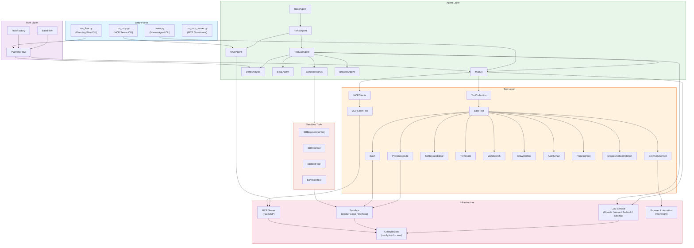
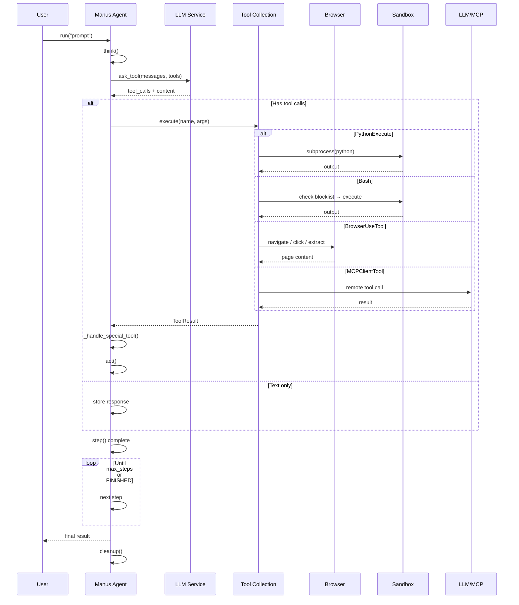

<p align="center">
  
</p>

English | [中文](README_zh.md) | [한국어](README_ko.md) | [日本語](README_ja.md)

[](https://github.com/FoundationAgents/OpenManus/stargazers)
&ensp;
[](https://opensource.org/licenses/MIT) &ensp;
[](https://github.com/FoundationAgents/OpenManus/actions/workflows/ci.yaml)
&ensp;
[](https://github.com/FoundationAgents/OpenManus/actions/workflows/ci.yaml)
&ensp;
[](https://discord.gg/DYn29wFk9z)
[](https://huggingface.co/spaces/lyh-917/OpenManusDemo)
[](https://doi.org/10.5281/zenodo.15186407)

# 👋 OpenManus

Manus is incredible, but OpenManus can achieve any idea without an *Invite Code* 🛫!

Our team members [@Xinbin Liang](https://github.com/mannaandpoem) and [@Jinyu Xiang](https://github.com/XiangJinyu) (core authors), along with [@Zhaoyang Yu](https://github.com/MoshiQAQ), [@Jiayi Zhang](https://github.com/didiforgithub), and [@Sirui Hong](https://github.com/stellaHSR), we are from [@MetaGPT](https://github.com/geekan/MetaGPT). The prototype is launched within 3 hours and we are keeping building!

It's a simple implementation, so we welcome any suggestions, contributions, and feedback!

Enjoy your own agent with OpenManus!

We're also excited to introduce [OpenManus-RL](https://github.com/OpenManus/OpenManus-RL), an open-source project dedicated to reinforcement learning (RL)- based (such as GRPO) tuning methods for LLM agents, developed collaboratively by researchers from UIUC and OpenManus.

## Project Demo

<video src="https://private-user-images.githubusercontent.com/61239030/420168772-6dcfd0d2-9142-45d9-b74e-d10aa75073c6.mp4?jwt=eyJhbGciOiJIUzI1NiIsInR5cCI6IkpXVCJ9.eyJpc3MiOiJnaXRodWIuY29tIiwiYXVkIjoicmF3LmdpdGh1YnVzZXJjb250ZW50LmNvbSIsImtleSI6ImtleTUiLCJleHAiOjE3NDEzMTgwNTksIm5iZiI6MTc0MTMxNzc1OSwicGF0aCI6Ii82MTIzOTAzMC80MjAxNjg3NzItNmRjZmQwZDItOTE0Mi00NWQ5LWI3NGUtZDEwYWE3NTA3M2M2Lm1wND9YLUFtei1BbGdvcml0aG09QVdTNC1ITUFDLVNIQTI1NiZYLUFtei1DcmVkZW50aWFsPUFLSUFWQ09EWUxTQTUzUFFLNFpBJTJGMjAyNTAzMDclMkZ1cy1lYXN0LTElMkZzMyUyRmF3czRfcmVxdWVzdCZYLUFtei1EYXRlPTIwMjUwMzA3VDAzMjIzOVomWC1BbXotRXhwaXJlcz0zMDAmWC1BbXotU2lnbmF0dXJlPTdiZjFkNjlmYWNjMmEzOTliM2Y3M2VlYjgyNDRlZDJmOWE3NWZhZjE1MzhiZWY4YmQ3NjdkNTYwYTU5ZDA2MzYmWC1BbXotU2lnbmVkSGVhZGVycz1ob3N0In0.UuHQCgWYkh0OQq9qsUWqGsUbhG3i9jcZDAMeHjLt5T4" data-canonical-src="https://private-user-images.githubusercontent.com/61239030/420168772-6dcfd0d2-9142-45d9-b74e-d10aa75073c6.mp4?jwt=eyJhbGciOiJIUzI1NiIsInR5cCI6IkpXVCJ9.eyJpc3MiOiJnaXRodWIuY29tIiwiYXVkIjoicmF3LmdpdGh1YnVzZXJjb250ZW50LmNvbSIsImtleSI6ImtleTUiLCJleHAiOjE3NDEzMTgwNTksIm5iZiI6MTc0MTMxNzc1OSwicGF0aCI6Ii82MTIzOTAzMC80MjAxNjg3NzItNmRjZmQwZDItOTE0Mi00NWQ5LWI3NGUtZDEwYWE3NTA3M2M2Lm1wND9YLUFtei1BbGdvcml0aG09QVdTNC1ITUFDLVNIQTI1NiZYLUFtei1DcmVkZW50aWFsPUFLSUFWQ09EWUxTQTUzUFFLNFpBJTJGMjAyNTAzMDclMkZ1cy1lYXN0LTElMkZzMyUyRmF3czRfcmVxdWVzdCZYLUFtei1EYXRlPTIwMjUwMzA3VDAzMjIzOVomWC1BbXotRXhwaXJlcz0zMDAmWC1BbXotU2lnbmF0dXJlPTdiZjFkNjlmYWNjMmEzOTliM2Y3M2VlYjgyNDRlZDJmOWE3NWZhZjE1MzhiZWY4YmQ3NjdkNTYwYTU5ZDA2MzYmWC1BbXotU2lnbmVkSGVhZGVycz1ob3N0In0.UuHQCgWYkh0OQq9qsUWqGsUbhG3i9jcZDAMeHjLt5T4" controls="controls" muted="muted" class="d-block rounded-bottom-2 border-top width-fit" style="max-height:640px; min-height: 200px"></video>

## Installation

We provide two installation methods. Method 2 (using uv) is recommended for faster installation and better dependency management.

### Method 1: Using conda

1. Create a new conda environment:

```bash
conda create -n open_manus python=3.12
conda activate open_manus
```

2. Clone the repository:

```bash
git clone https://github.com/FoundationAgents/OpenManus.git
cd OpenManus
```

3. Install dependencies:

```bash
pip install -r requirements.txt
```

### Method 2: Using uv (Recommended)

1. Install uv (A fast Python package installer and resolver):

```bash
curl -LsSf https://astral.sh/uv/install.sh | sh
```

2. Clone the repository:

```bash
git clone https://github.com/FoundationAgents/OpenManus.git
cd OpenManus
```

3. Create a new virtual environment and activate it:

```bash
uv venv --python 3.12
source .venv/bin/activate  # On Unix/macOS
# Or on Windows:
# .venv\\Scripts\\activate
```

4. Install dependencies:

```bash
uv pip install -r requirements.txt
```

### Browser Automation Tool (Optional)
```bash
playwright install
```

## Configuration

OpenManus requires configuration for the LLM APIs it uses. Follow these steps to set up your configuration:

1. Create a `config.toml` file in the `config` directory (you can copy from the example):

```bash
cp config/config.example.toml config/config.toml
```

2. Edit `config/config.toml` to add your API keys and customize settings:

```toml
# Global LLM configuration
[llm]
model = "gpt-4o"
base_url = "https://api.openai.com/v1"
api_key = "sk-..."  # Replace with your actual API key
max_tokens = 4096
temperature = 0.0

# Optional configuration for specific LLM models
[llm.vision]
model = "gpt-4o"
base_url = "https://api.openai.com/v1"
api_key = "sk-..."  # Replace with your actual API key
```

> **Security Note:** API keys can also be set via environment variables (e.g., `LLM_API_KEY`, `VNC_PASSWORD`, `PROXY_PASSWORD`). See `.env.example` for all available options. Environment variables override config.toml values.

## Quick Start

One line for run OpenManus:

```bash
python main.py
```

Then input your idea via terminal!

For MCP tool version, you can run:
```bash
python run_mcp.py
```

For unstable multi-agent version, you also can run:

```bash
python run_flow.py
```

### Custom Adding Multiple Agents

Currently, besides the general OpenManus Agent, we have also integrated the DataAnalysis Agent, which is suitable for data analysis and data visualization tasks. You can add this agent to `run_flow` in `config.toml`.

```toml
# Optional configuration for run-flow
[runflow]
use_data_analysis_agent = true     # Disabled by default, change to true to activate
```
In addition, you need to install the relevant dependencies to ensure the agent runs properly: [Detailed Installation Guide](app/tool/chart_visualization/README.md##Installation)

---

## 🚀 Running with the Project venv (recommended)

If your system has a different Python installed globally (e.g. Python 3.14) whose `PYTHONPATH` interferes with the project's virtualenv, activate the project venv and **clear `PYTHONPATH` first**:

```bash
cd OpenManus
unset PYTHONPATH
source .venv/bin/activate
python main.py
```

The following helper scripts are included to avoid repeating this:

| Script | Purpose |
|---|---|
| `activate_openmanus.sh` | Unsets `PYTHONPATH` and activates the project venv |
| `run_agent_test.sh` | Activates the venv and runs `main.py` with a test prompt (customizable) |
| `test_om_flow.sh` | Full validation suite: `om`/`omtest` aliases, clean venv, agent startup (+ LLM auth status) |

#### Writing new shell scripts (shared helpers in `lib/common.sh`)

All project shell scripts must source the shared helpers instead of re-implementing the boilerplate:

```bash
#!/bin/bash
set -euo pipefail

# Resolve the script's directory robustly (relative path, PATH or symlink safe)
SCRIPT_DIR="$(cd "$(dirname "${BASH_SOURCE[0]}")" && pwd)"
source "$SCRIPT_DIR/lib/common.sh"   # shared helpers below

# 1. Clear the system PYTHONPATH before activating the project venv
om_unset_pythonpath

# 2. Guard: clear message if the venv is missing (use `|| exit 1` in executed
#    scripts, or `|| return 1 2>/dev/null || exit 1` in *sourced* scripts)
om_require_venv "$SCRIPT_DIR" || exit 1
source "$SCRIPT_DIR/.venv/bin/activate"
```

> **Rule:** never hardcode `unset PYTHONPATH` or the venv guard inline — always `source "$SCRIPT_DIR/lib/common.sh"` and use `om_unset_pythonpath` / `om_require_venv`.

```bash
# Activate the environment (unset PYTHONPATH + venv)
source activate_openmanus.sh

# Run the agent with the default test prompt
./run_agent_test.sh

# Run the agent with a custom prompt
./run_agent_test.sh "Write a haiku about the sea"

# Run the agent AND the full validation suite (test_om_flow.sh)
./run_agent_test.sh --flow
# or: CHECK_FLOW=1 ./run_agent_test.sh
```

`test_om_flow.sh` can also be run standalone:

```bash
./test_om_flow.sh                 # default checks (aliases + venv + agent start)
./test_om_flow.sh "your prompt"   # custom prompt
./test_om_flow.sh "prompt" --verbose   # show the raw omtest output
```

### Convenience aliases

Add these to your `~/.bashrc` (or `~/.zshrc`):

```bash
# OpenManus: clean env + project venv (reuses activate_openmanus.sh)
alias om="cd ~/OpenManus && source activate_openmanus.sh"

# Run the agent with a test prompt
alias omtest="~/OpenManus/run_agent_test.sh"
```

After `source ~/.bashrc`, usage is:

```bash
om          # enter the project with a clean venv
omtest      # run the agent with a default test prompt
```

### Running the OpenRouter connection test

`test_openrouter.py` validates connectivity, lists available models, and confirms the tracking headers (`HTTP-Referer` / `X-Title`) are sent:

```bash
# Reads the key from OPENROUTER_API_KEY / LLM_API_KEY env vars, or from the
# .env file in the project root (it does NOT read config/config.toml)
export OPENROUTER_API_KEY=sk-or-v1-...   # required if not in .env
unset PYTHONPATH && ./.venv/bin/python test_openrouter.py
```

OpenRouter tracking headers are configurable via `config.toml` (`http_referer` / `x_title`) or the `OPENROUTER_HTTP_REFERER` / `OPENROUTER_X_TITLE` env vars — see [`.env.example`](.env.example).

### OpenRouter key & config utilities

The following Python utilities automate the OpenRouter setup above. None of them hardcode or print the full key — only a masked prefix, length and checksum (each row states where its key comes from):

| Script | Purpose |
|---|---|
| `insert_openrouter_key.py` | Inserts/updates `OPENROUTER_API_KEY` in `.env` from a **base64-encoded key** (bypasses chat secret-masking); validates the `sk-or-v1-` format and writes the file with `0600` perms; `--verify` also checks the key live against the OpenRouter API |
| `update_openrouter_config.py` | Sets the default/vision models and copies the real key from `.env` into `config/config.toml` (validates the TOML before writing; idempotent — safe to re-run) |
| `test_ask_tool_models.py` | Re-tests candidate (free) models with the **real Manus tool payload** via `ask_tool` (key read via config → env vars / `.env`), to pick models that don't reject the agent's tool schemas |

```bash
# 1. Insert a key into .env from base64 (argv or stdin; --verify adds a live API check)
echo 'BASE64_DA_CHAVE' | ./.venv/bin/python insert_openrouter_key.py
./.venv/bin/python insert_openrouter_key.py --verify 'BASE64_DA_CHAVE'

# 2. Point config.toml at working free models + the real key
unset PYTHONPATH && ./.venv/bin/python update_openrouter_config.py

# 3. Re-validate candidate models with the real agent payload
unset PYTHONPATH && ./.venv/bin/python test_ask_tool_models.py
```

---

## 🤖 Using OpenCode with OpenRouter

[OpenCode](https://opencode.ai) is a terminal AI coding assistant. To use it with OpenRouter:

### 1. Install

```bash
curl -fsSL https://opencode.ai/install | bash
export PATH=$HOME/.opencode/bin:$PATH   # add to ~/.bashrc
```

### 2. Authenticate

```bash
opencode auth login -p openrouter
# Paste your OpenRouter API key (sk-or-v1-...) when prompted
```

> OpenRouter keys **always start with `sk-or-v1-`**. Keys in other formats are rejected with `401 Missing Authentication header`. Create one at <https://openrouter.ai/settings/keys>.

Credentials are stored in `~/.local/share/opencode/auth.json`. Check or remove them with:

```bash
opencode auth list      # show configured providers
opencode auth logout openrouter   # remove the credential (e.g. to re-login)
```

Alternatively, OpenCode auto-detects the `OPENROUTER_API_KEY` environment variable — no login needed:

```bash
export OPENROUTER_API_KEY=sk-or-v1-...
```

### 3. Run

```bash
# One-shot prompt (non-interactive — recommended for scripts)
echo 'Diga apenas a palavra OK' | opencode run --model openrouter/openai/gpt-4o-mini 'Diga apenas a palavra OK'

# Interactive session
opencode
```

> **Note:** without piped stdin, `opencode run` opens the interactive TUI. Pipe a prompt (`echo ... | opencode run ...`) when scripting.

---

## 🏗️ Architecture

OpenManus follows a **layered, modular architecture** with clear separation of concerns:



### 🧬 Component Hierarchy

```
BaseAgent (abstract)
 └── ReActAgent (think → act loop)
      ├── ToolCallAgent (tool/function calling)
      │    ├── Manus (general-purpose with MCP)
      │    ├── DataAnalysis (data visualization)
      │    ├── SWEAgent (software engineering)
      │    ├── SandboxManus (sandbox-isolated)
      │    └── BrowserAgent (browser-specific)
      └── MCPAgent (MCP protocol agent)
```

### 📁 Project Structure

```
OpenManus/
├── main.py                    # Entry point: Manus agent CLI
├── run_flow.py                # Multi-agent planning flow
├── run_mcp.py                 # MCP agent runner
├── run_mcp_server.py          # Standalone MCP server
├── sandbox_main.py            # Sandbox agent runner
│
├── app/
│   ├── agent/                 # Agent implementations
│   │   ├── base.py            #   BaseAgent (ABC)
│   │   ├── react.py           #   ReActAgent (think→act)
│   │   ├── toolcall.py        #   ToolCallAgent
│   │   ├── manus.py           #   Manus (flagship agent)
│   │   ├── browser.py         #   BrowserAgent
│   │   ├── data_analysis.py   #   DataAnalysisAgent
│   │   ├── swe.py             #   SWEAgent
│   │   ├── mcp.py             #   MCPAgent
│   │   └── sandbox_agent.py   #   SandboxManus
│   │
│   ├── tool/                  # Tool implementations
│   │   ├── base.py            #   BaseTool (ABC)
│   │   ├── tool_collection.py #   ToolCollection
│   │   ├── python_execute.py  #   Isolated code execution
│   │   ├── bash.py            #   Terminal with blocklist
│   │   ├── browser_use_tool.py#   Browser automation
│   │   ├── str_replace_editor.py# File editing
│   │   ├── mcp.py             #   MCP client tools
│   │   ├── web_search.py      #   Multi-engine search
│   │   ├── crawl4ai.py        #   Web crawling
│   │   ├── terminate.py       #   Termination tool
│   │   ├── planning.py        #   Planning tool
│   │   └── sandbox/           #   Sandbox-specific tools
│   │
│   ├── flow/                  # Orchestration flows
│   │   ├── base.py            #   BaseFlow
│   │   ├── flow_factory.py    #   FlowFactory
│   │   └── planning.py        #   PlanningFlow (step exec)
│   │
│   ├── mcp/                   # MCP protocol server
│   │   └── server.py          #   FastMCP-based server
│   │
│   ├── daytona/               # Daytona sandbox client
│   │   ├── client.py          #   Shared init (lazy)
│   │   ├── sandbox.py         #   CRUD operations
│   │   └── tool_base.py       #   SandboxToolsBase
│   │
│   ├── sandbox/               # Local Docker sandbox
│   │   ├── client.py          #   LocalSandboxClient
│   │   └── core/              #   Manager, terminal
│   │
│   ├── prompt/                # System prompts
│   ├── config.py              # Singleton config loader
│   ├── llm.py                 # LLM service + rate limiter
│   ├── schema.py              # Data models
│   ├── logger.py              # Logging
│   └── exceptions.py          # Custom exceptions
│
├── config/
│   ├── config.example.toml    # Config template
│   └── mcp.example.json       # MCP server config
│
├── tests/                     # Test suite (61+ tests)
│   ├── conftest.py
│   ├── test_toolcall_agent.py # 22 tests
│   ├── test_manus_agent.py    # 14 tests
│   ├── test_python_execute.py # 11 tests
│   └── test_bash_tool.py      # 14 tests
│
└── .env.example               # Environment variables template
```

---

## 🔄 Data Flow



---

## 🔒 Security Features

OpenManus includes several security measures implemented across Sprints:

### 1. Credential Management
- **API keys read from env vars** (`LLM_API_KEY`, `PROXY_PASSWORD`, `VNC_PASSWORD`)
- `.env` file support via `python-dotenv`
- **No hardcoded credentials** in source code

### 2. Code Execution Safety
- `PythonExecute` runs in **isolated subprocess** (`create_subprocess_exec`), not `exec()`
- Built-in timeout prevents runaway execution
- Clean stdout/stderr capture

### 3. Shell Command Blocklist
The `Bash` tool blocks destructive commands via `_check_blocked_commands()`:

| Blocked Pattern | Example |
|---|---|
| `rm -rf /` or `rm -rf ~` | Recursive root deletion |
| `mkfs.*` | Filesystem formatting |
| `dd if=` | Raw disk writes |
| `chmod 777 /` | Permission escalation |
| Fork bombs | `:(){ :\|:& };:` |
| `reboot`, `shutdown`, `halt` | System control |

### 4. Browser Safety
- Default: **headless mode** (`headless=True`)
- **Security features enabled** (`disable_security=False`)
- Configurable via `BrowserSettings`

### 5. Rate Limiting
- Built-in `RateLimiter` in `LLM` service
- Configurable max calls per time window
- Async-safe via `asyncio.Lock`

---

## 🛡️ Secret Scanning (GitGuardian / ggshield)

Secrets (API keys, tokens, passwords) must never reach the repository. This project uses **GitGuardian ggshield** in three complementary layers:

### 1. Local pre-commit / pre-push blocking

`ggshield` is registered as a **local pre-commit hook** (see `.pre-commit-config.yaml`), so commits and pushes containing secrets are **blocked before they reach the remote**:

```bash
# Install ggshield (standalone binary, no sudo) - check the releases page for the
# current version: https://github.com/GitGuardian/ggshield/releases
curl -fsSL https://github.com/GitGuardian/ggshield/releases/latest/download/ggshield-1.53.0-x86_64-unknown-linux-gnu.tar.gz -o /tmp/ggshield.tar.gz && tar xzf /tmp/ggshield.tar.gz -C /tmp && cp /tmp/ggshield-1.53.0-x86_64-unknown-linux-gnu/ggshield ~/.local/bin/ && chmod +x ~/.local/bin/ggshield
# Alternative (always current): pipx install ggshield

# Authenticate (required for secret scans):
export GITGUARDIAN_API_KEY=your-gitguardian-api-key   # or: ggshield auth login

# Install the hooks (registers pre-commit + pre-push):
pre-commit install
pre-commit install --hook-type pre-push
```

> The hook **skips cleanly when `GITGUARDIAN_API_KEY` is unset**, so it never blocks development before authentication.

### 2. CI/CD integration (GitHub Actions)

`.github/workflows/secret-scan.yaml` runs `ggshield secret scan` on **every push, pull request, and daily (cron)** on the `main` branch.

To enable it in your GitHub repository:

1. Create a GitGuardian account → [dashboard.gitguardian.com](https://dashboard.gitguardian.com)
2. Generate an API token: **Settings → API → Create a new token** (with `scan` scope)
3. Add it as a repository secret: **Settings → Secrets and variables → Actions → New repository secret** → name `GITGUARDIAN_API_KEY`
4. Until the secret is set, the workflow simply doesn't run the scan step (no failure)

### 3. Connect repositories & continuous commit scanning (GitGuardian dashboard)

For **continuous scanning of every commit ever pushed** (including history), connect the repository to the GitGuardian dashboard:

1. In the dashboard: **Repositories → Add repository** (or *Install on GitHub/GitLab*)
2. Authorize GitGuardian to access the repository (GitHub App for GitHub; integration for GitLab)
3. GitGuardian will scan the **full history** and every future commit automatically

### 4. Alerts & incident owners

Configure who gets notified and who owns remediation in the dashboard:

| Setting | Where | Recommendation |
|---|---|---|
| **Alert channels** | Settings → Alerting | Email + Slack/Teams webhook (incidents, high severity only) |
| **Incident owners** | Settings → Incident management → Assignees | Assign owners per repository/team, enable **auto-assignment** |
| **Severity rules** | Settings → Incident management → Rules | Auto-assign by detector/severity (e.g. all `OpenAI API Key` → security team) |
| **Remediation workflow** | Dashboard → Incident | Rotate the leaked secret immediately, then push a fix |

**Incident response checklist:**

1. **Rotate/revoke the leaked secret immediately** (at the provider)
2. Remove it from the repo: `git filter-repo` or BFG, then force-push
3. Re-scan to confirm zero findings
4. Update the owner/assignee status in the dashboard

---

## 🧪 Testing

Tests are organized in the `tests/` directory and use `pytest` with `pytest-asyncio`:

```bash
# Run all tests
python -m pytest tests/ -v

# Run specific test file
python -m pytest tests/test_toolcall_agent.py -v

# Run with coverage report
python -m pytest tests/ --cov=app --cov-report=term-missing
```

### Test Coverage (75 tests)

| Test File | Tests | What It Covers |
|---|---|---|
| `test_toolcall_agent.py` | 22 | Think/act cycle, tool calls, edge cases, error handling |
| `test_manus_agent.py` | 14 | Factory creation, MCP init, browser context, cleanup |
| `test_python_execute.py` | 11 | Subprocess isolation, timeouts, syntax/runtime errors |
| `test_bash_tool.py` | 14 | Basic execution, security blocklist (7 patterns), safe commands |
| `test_search_cache.py` | 14 | TTL cache, metrics collector, search result validation |

---

## 🛣️ Roadmap

| Sprint | Focus | Status |
|---|---|---|
| **Sprint 1** | 🔒 Security: env vars, subprocess isolation, bash blocklist, browser safety | ✅ Complete |
| **Sprint 2** | 🧪 Tests: 61 tests across all core components | ✅ Complete |
| **Sprint 3** | 🎯 Quality: Daytona unification, dead code removal, rate limiting | ✅ Complete |
| **Sprint 4** | 📖 Documentation: architecture diagrams, project structure docs | ✅ Complete |
| **Sprint 5** | ⚙️ CI/CD: GitHub Actions pipeline (test, lint, syntax) | ✅ Complete |
| **Sprint 6** | ⚡ Performance: search cache, metrics collector, observability | ✅ Complete |

---

## 🛠️ Development

### Pre-commit

Before submitting a pull request, run the pre-commit checks:

```bash
pre-commit run --all-files
```

### Adding a New Tool

1. Create a new class in `app/tool/` inheriting from `BaseTool`
2. Define `name`, `description`, `parameters` (JSON Schema)
3. Implement the `execute()` method
4. Add to `app/tool/__init__.py`
5. Add to the Manus agent if it should be available by default

### Adding a New Agent

1. Inherit from `ToolCallAgent` (or `ReActAgent` for simpler agents)
2. Override `think()` and/or `act()` as needed
3. Define system prompts in `app/prompt/`
4. Register in the appropriate entry point (`main.py`, `run_flow.py`)

---

## How to contribute

We welcome any friendly suggestions and helpful contributions! Just create issues or submit pull requests.

Or contact @mannaandpoem via 📧email: mannaandpoem@gmail.com

**Note**: Before submitting a pull request, please use the pre-commit tool to check your changes. Run `pre-commit run --all-files` to execute the checks.

## Community Group
Join our networking group on Feishu and share your experience with other developers!

<div align="center" style="display: flex; gap: 20px;">
    
</div>

## Star History

[](https://star-history.com/#FoundationAgents/OpenManus&Date)

## Sponsors
Thanks to [PPIO](https://ppinfra.com/user/register?invited_by=OCPKCN&utm_source=github_openmanus&utm_medium=github_readme&utm_campaign=link) for computing source support.
> PPIO: The most affordable and easily-integrated MaaS and GPU cloud solution.


## Acknowledgement

Thanks to [anthropic-computer-use](https://github.com/anthropics/anthropic-quickstarts/tree/main/computer-use-demo), [browser-use](https://github.com/browser-use/browser-use) and [crawl4ai](https://github.com/unclecode/crawl4ai) for providing basic support for this project!

Additionally, we are grateful to [AAAJ](https://github.com/metauto-ai/agent-as-a-judge), [MetaGPT](https://github.com/geekan/MetaGPT), [OpenHands](https://github.com/All-Hands-AI/OpenHands) and [SWE-agent](https://github.com/SWE-agent/SWE-agent).

We also thank stepfun(阶跃星辰) for supporting our Hugging Face demo space.

OpenManus is built by contributors from MetaGPT. Huge thanks to this agent community!

---

## 🎮 Educational HTML Assets

This repository includes several standalone HTML educational resources for History teaching (BNCC-aligned, 6th-9th grade):

### 🃏 Memory Games

| File | Theme | Pairs | Sound | Grade |
|---|---|---|---|---|
| `jogo_memoria_reforma.html` | Protestant Reformation | 12 pairs | ✅ Web Audio API | 7th |
| `jogo_memoria_brasil_colonia.html` | Colonial Brazil | 20 pairs | ✅ Web Audio API | 7th-8th |
| `jogo_memoria_holandesas_digital.html` | Dutch Invasions | 16 pairs | ✅ Web Audio API | 7th-8th |
| `jogo_memoria_holandesas.html` | Dutch Invasions (print) | 8 pairs | 🖨️ Print-friendly | 7th-8th |

### 🧠 History Quiz (React + Tailwind)

| File | Questions | Themes | Features |
|---|---|---|---|
| `quiz_historico.html` 🇧🇷 | **311 questions** | 42 themes (6th-9th) | 3 modes (Study/Quiz/Timer), 12 achievements, SoundFX, BNCC codes |
| `quiz_historico_en.html` 🇺🇸 | **311 questions** | 42 themes (6th-9th) | Same features, fully translated to English |

### 📊 School Management Systems

| File | Description | Tech |
|---|---|---|
| `gestao_escolar.html` | Weekly grid, reports, JSON backup, occupancy dashboard | Vanilla HTML/CSS/JS |
| `escola_organizada.html` | Space scheduling, login, conflict detection, CSV export | React + Tailwind |

### 🤖 Local AI Agent

| File | Description |
|---|---|
| `agente_ollama.py` | 10-tool local agent with Ollama function calling |
| `guia_agente_local_ollama.md` | Step-by-step guide to build your own local agent |

All HTML files are **zero-dependency** (open directly in browser) or use **CDN** (React, Tailwind).

---

## Cite
```bibtex
@misc{openmanus2025,
  author = {Xinbin Liang and Jinyu Xiang and Zhaoyang Yu and Jiayi Zhang and Sirui Hong and Sheng Fan and Xiao Tang and Bang Liu and Yuyu Luo and Chenglin Wu},
  title = {OpenManus: An open-source framework for building general AI agents},
  year = {2025},
  publisher = {Zenodo},
  doi = {10.5281/zenodo.15186407},
  url = {https://doi.org/10.5281/zenodo.15186407},
}
```
