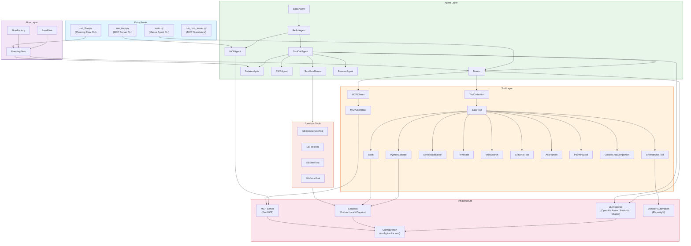
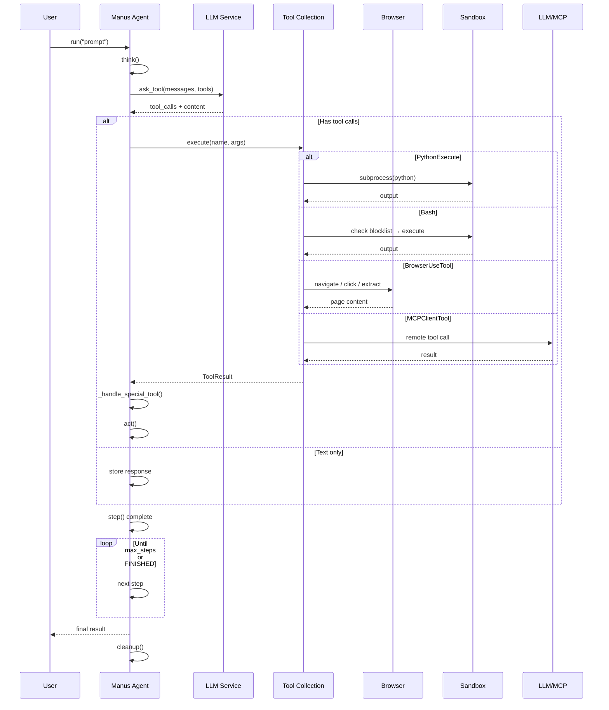

<p align="center">
  
</p>

[English](README.md) | [中文](README_zh.md) | [한국어](README_ko.md) | 日本語

[](https://github.com/FoundationAgents/OpenManus/stargazers)
&ensp;
[](https://opensource.org/licenses/MIT) &ensp;
[](https://discord.gg/DYn29wFk9z)
[](https://huggingface.co/spaces/lyh-917/OpenManusDemo)
[](https://doi.org/10.5281/zenodo.15186407)

# 👋 OpenManus

Manusは素晴らしいですが、OpenManusは*招待コード*なしでどんなアイデアも実現できます！🛫

私たちのチームメンバー [@Xinbin Liang](https://github.com/mannaandpoem) と [@Jinyu Xiang](https://github.com/XiangJinyu)（主要開発者）、そして [@Zhaoyang Yu](https://github.com/MoshiQAQ)、[@Jiayi Zhang](https://github.com/didiforgithub)、[@Sirui Hong](https://github.com/stellaHSR) は [@MetaGPT](https://github.com/geekan/MetaGPT) から来ました。プロトタイプは3時間以内に立ち上げられ、継続的に開発を進めています！

これはシンプルな実装ですので、どんな提案、貢献、フィードバックも歓迎します！

OpenManusで自分だけのエージェントを楽しみましょう！

また、UIUCとOpenManusの研究者が共同開発した[OpenManus-RL](https://github.com/OpenManus/OpenManus-RL)をご紹介できることを嬉しく思います。これは強化学習（RL）ベース（GRPOなど）のLLMエージェントチューニング手法に特化したオープンソースプロジェクトです。

## プロジェクトデモ

<video src="https://private-user-images.githubusercontent.com/61239030/420168772-6dcfd0d2-9142-45d9-b74e-d10aa75073c6.mp4?jwt=eyJhbGciOiJIUzI1NiIsInR5cCI6IkpXVCJ9.eyJpc3MiOiJnaXRodWIuY29tIiwiYXVkIjoicmF3LmdpdGh1YnVzZXJjb250ZW50LmNvbSIsImtleSI6ImtleTUiLCJleHAiOjE3NDEzMTgwNTksIm5iZiI6MTc0MTMxNzc1OSwicGF0aCI6Ii82MTIzOTAzMC80MjAxNjg3NzItNmRjZmQwZDItOTE0Mi00NWQ5LWI3NGUtZDEwYWE3NTA3M2M2Lm1wND9YLUFtei1BbGdvcml0aG09QVdTNC1ITUFDLVNIQTI1NiZYLUFtei1DcmVkZW50aWFsPUFLSUFWQ09EWUxTQTUzUFFLNFpBJTJGMjAyNTAzMDclMkZ1cy1lYXN0LTElMkZzMyUyRmF3czRfcmVxdWVzdCZYLUFtei1EYXRlPTIwMjUwMzA3VDAzMjIzOVomWC1BbXotRXhwaXJlcz0zMDAmWC1BbXotU2lnbmF0dXJlPTdiZjFkNjlmYWNjMmEzOTliM2Y3M2VlYjgyNDRlZDJmOWE3NWZhZjE1MzhiZWY4YmQ3NjdkNTYwYTU5ZDA2MzYmWC1BbXotU2lnbmVkSGVhZGVycz1ob3N0In0.UuHQCgWYkh0OQq9qsUWqGsUbhG3i9jcZDAMeHjLt5T4" data-canonical-src="https://private-user-images.githubusercontent.com/61239030/420168772-6dcfd0d2-9142-45d9-b74e-d10aa75073c6.mp4?jwt=eyJhbGciOiJIUzI1NiIsInR5cCI6IkpXVCJ9.eyJpc3MiOiJnaXRodWIuY29tIiwiYXVkIjoicmF3LmdpdGh1YnVzZXJjb250ZW50LmNvbSIsImtleSI6ImtleTUiLCJleHAiOjE3NDEzMTgwNTksIm5iZiI6MTc0MTMxNzc1OSwicGF0aCI6Ii82MTIzOTAzMC80MjAxNjg3NzItNmRjZmQwZDItOTE0Mi00NWQ5LWI3NGUtZDEwYWE3NTA3M2M2Lm1wND9YLUFtei1BbGdvcml0aG09QVdTNC1ITUFDLVNIQTI1NiZYLUFtei1DcmVkZW50aWFsPUFLSUFWQ09EWUxTQTUzUFFLNFpBJTJGMjAyNTAzMDclMkZ1cy1lYXN0LTElMkZzMyUyRmF3czRfcmVxdWVzdCZYLUFtei1EYXRlPTIwMjUwMzA3VDAzMjIzOVomWC1BbXotRXhwaXJlcz0zMDAmWC1BbXotU2lnbmF0dXJlPTdiZjFkNjlmYWNjMmEzOTliM2Y3M2VlYjgyNDRlZDJmOWE3NWZhZjE1MzhiZWY4YmQ3NjdkNTYwYTU5ZDA2MzYmWC1BbXotU2lnbmVkSGVhZGVycz1ob3N0In0.UuHQCgWYkh0OQq9qsUWqGsUbhG3i9jcZDAMeHjLt5T4" controls="controls" muted="muted" class="d-block rounded-bottom-2 border-top width-fit" style="max-height:640px; min-height: 200px"></video>

## インストール方法

インストール方法は2つ提供しています。方法2（uvを使用）は、より高速なインストールと優れた依存関係管理のため推奨されています。

### 方法1：condaを使用

1. 新しいconda環境を作成します：

```bash
conda create -n open_manus python=3.12
conda activate open_manus
```

2. リポジトリをクローンします：

```bash
git clone https://github.com/FoundationAgents/OpenManus.git
cd OpenManus
```

3. 依存関係をインストールします：

```bash
pip install -r requirements.txt
```

### 方法2：uvを使用（推奨）

1. uv（高速なPythonパッケージインストーラーと管理機能）をインストールします：

```bash
curl -LsSf https://astral.sh/uv/install.sh | sh
```

2. リポジトリをクローンします：

```bash
git clone https://github.com/FoundationAgents/OpenManus.git
cd OpenManus
```

3. 新しい仮想環境を作成してアクティベートします：

```bash
uv venv --python 3.12
source .venv/bin/activate  # Unix/macOSの場合
# Windowsの場合：
# .venv\Scripts\activate
```

4. 依存関係をインストールします：

```bash
uv pip install -r requirements.txt
```

### ブラウザ自動化ツール（オプション）
```bash
playwright install
```

## 設定

OpenManusを使用するには、LLM APIの設定が必要です。以下の手順に従って設定してください：

1. `config`ディレクトリに`config.toml`ファイルを作成します（サンプルからコピーできます）：

```bash
cp config/config.example.toml config/config.toml
```

2. `config/config.toml`を編集してAPIキーを追加し、設定をカスタマイズします：

```toml
# グローバルLLM設定
[llm]
model = "gpt-4o"
base_url = "https://api.openai.com/v1"
api_key = "sk-..."  # 実際のAPIキーに置き換えてください
max_tokens = 4096
temperature = 0.0

# 特定のLLMモデル用のオプション設定
[llm.vision]
model = "gpt-4o"
base_url = "https://api.openai.com/v1"
api_key = "sk-..."  # 実際のAPIキーに置き換えてください
```

## クイックスタート

OpenManusを実行する一行コマンド：

```bash
python main.py
```

その後、ターミナルからプロンプトを入力してください！

MCP ツールバージョンを使用する場合は、以下を実行します：
```bash
python run_mcp.py
```

開発中のマルチエージェントバージョンを試すには、以下を実行します：

```bash
python run_flow.py
```

## カスタムマルチエージェントの追加

現在、一般的なOpenManusエージェントに加えて、データ分析とデータ可視化タスクに適したDataAnalysisエージェントが組み込まれています。このエージェントを`config.toml`の`run_flow`に追加することができます。

```toml
# run-flowのオプション設定
[runflow]
use_data_analysis_agent = true     # デフォルトでは無効、trueに変更すると有効化されます
```

これに加えて、エージェントが正常に動作するために必要な依存関係をインストールする必要があります：[具体的なインストールガイド](app/tool/chart_visualization/README_ja.md##インストール)


---

## 🚀 プロジェクトの venv で実行（推奨）

システムに別の Python（例：Python 3.14）がグローバルにインストールされていて、その `PYTHONPATH` がプロジェクトの仮想環境と干渉する場合は、プロジェクトの venv を有効化し、**先に `PYTHONPATH` をクリア**してください：

```bash
cd OpenManus
unset PYTHONPATH
source .venv/bin/activate
python main.py
```

この繰り返しを避けるために、2つのヘルパースクリプトが用意されています：

| スクリプト | 目的 |
|---|---|
| `activate_openmanus.sh` | `PYTHONPATH` をクリアし、プロジェクトの venv を有効化 |
| `run_agent_test.sh` | venv を有効化し、テスト用プロンプトで `main.py` を実行（カスタマイズ可能） |

```bash
# 環境を有効化（PYTHONPATH 解除 + venv）
source activate_openmanus.sh

# デフォルトのテスト用プロンプトでエージェントを実行
./run_agent_test.sh

# カスタムプロンプトでエージェントを実行
./run_agent_test.sh "海についての俳句を書いて"
```

### 便利なエイリアス

`~/.bashrc`（または `~/.zshrc`）に追加してください：

```bash
# OpenManus: 環境クリーン + プロジェクト venv（activate_openmanus.sh を再利用）
alias om="cd ~/OpenManus && source activate_openmanus.sh"

# テスト用プロンプトでエージェントを実行
alias omtest="~/OpenManus/run_agent_test.sh"
```

`source ~/.bashrc` 後の使い方:

```bash
om          # クリーンな venv でプロジェクトに入る
omtest      # デフォルトのテスト用プロンプトでエージェントを実行
```

### OpenRouter 接続テストの実行

`test_openrouter.py` は接続を検証し、利用可能なモデルを一覧表示し、トラッキングヘッダー（`HTTP-Referer` / `X-Title`）が送信されることを確認します：

```bash
# OPENROUTER_API_KEY / LLM_API_KEY 環境変数、またはプロジェクトルートの
# .env ファイルからキーを読み取ります（config/config.toml は読みません）
export OPENROUTER_API_KEY=sk-or-v1-...   # .env にない場合は必須
unset PYTHONPATH && ./.venv/bin/python test_openrouter.py
```

OpenRouter のトラッキングヘッダーは `config.toml`（`http_referer` / `x_title`）または `OPENROUTER_HTTP_REFERER` / `OPENROUTER_X_TITLE` 環境変数で設定できます — [`.env.example`](.env.example) を参照。

### OpenRouter キー・設定ユーティリティ

以下の Python ユーティリティは、上記の OpenRouter 設定を自動化します。いずれもキーをハードコードせず、完全なキーを出力しません — マスク済みプレフィックス・長さ・チェックサムのみを表示します（各行にキーの取得元を記載）：

| スクリプト | 用途 |
|---|---|
| `insert_openrouter_key.py` | **base64 エンコードされたキー**（チャットのシークレットマスキングを回避）から `.env` の `OPENROUTER_API_KEY` を挿入/更新；`sk-or-v1-` 形式を検証し、`0600` 権限でファイルを書き込み；`--verify` は OpenRouter API に対してキーをライブ確認 |
| `update_openrouter_config.py` | デフォルト/ビジョンモデルを設定し、`.env` の実際のキーを `config/config.toml` にコピー（書き込み前に TOML を検証；冪等 — 再実行しても安全） |
| `test_ask_tool_models.py` | `ask_tool` で**実際の Manus ツールペイロード**を使用して候補（無料）モデルを再テスト（キーは config → 環境変数 / `.env` から読み取り）、エージェントのツールスキーマを拒否しないモデルを選択 |

```bash
# 1. base64 から .env にキーを挿入（argv または stdin；--verify でライブ API チェックを追加）
echo 'BASE64_DA_CHAVE' | ./.venv/bin/python insert_openrouter_key.py
./.venv/bin/python insert_openrouter_key.py --verify 'BASE64_DA_CHAVE'

# 2. config.toml を作動する無料モデル + 実際のキーに設定
unset PYTHONPATH && ./.venv/bin/python update_openrouter_config.py

# 3. 実際のエージェントペイロードで候補モデルを再検証
unset PYTHONPATH && ./.venv/bin/python test_ask_tool_models.py
```

---

## 🤖 OpenCode と OpenRouter を使う

[OpenCode](https://opencode.ai) はターミナル型 AI コーディングアシスタントです。OpenRouter と併用する方法：

### 1. インストール

```bash
curl -fsSL https://opencode.ai/install | bash
export PATH=$HOME/.opencode/bin:$PATH   # ~/.bashrc に追加
```

### 2. 認証

```bash
opencode auth login -p openrouter
# プロンプトが表示されたら OpenRouter API キー（sk-or-v1-...）を貼り付け
```

> OpenRouter キーは**必ず `sk-or-v1-` で始まります**。他の形式のキーは `401 Missing Authentication header` で拒否されます。<https://openrouter.ai/settings/keys> で作成してください。

認証情報は `~/.local/share/opencode/auth.json` に保存されます。確認・削除は以下の通り：

```bash
opencode auth list      # 設定済みプロバイダーを表示
opencode auth logout openrouter   # 認証情報を削除（例：再ログイン時）
```

または、OpenCode は `OPENROUTER_API_KEY` 環境変数を自動検出します — ログイン不要：

```bash
export OPENROUTER_API_KEY=sk-or-v1-...
```

### 3. 実行

```bash
# ワンショットプロンプト（非対話型 — スクリプト推奨）
echo 'Diga apenas a palavra OK' | opencode run --model openrouter/openai/gpt-4o-mini 'Diga apenas a palavra OK'

# 対話型セッション
opencode
```

> **注意:** stdin パイプなしで `opencode run` を実行すると対話型 TUI が開きます。スクリプトではパイプ（`echo ... | opencode run ...`）を使ってください。

---

## 🏗️ アーキテクチャ

OpenManus は**階層的でモジュール化されたアーキテクチャ**を採用し、関心事を明確に分離しています：



### 🧬 コンポーネント階層

```
BaseAgent (abstract)
 └── ReActAgent (think → act loop)
      ├── ToolCallAgent (tool/function calling)
      │    ├── Manus (general-purpose with MCP)
      │    ├── DataAnalysis (data visualization)
      │    ├── SWEAgent (software engineering)
      │    ├── SandboxManus (sandbox-isolated)
      │    └── BrowserAgent (browser-specific)
      └── MCPAgent (MCP protocol agent)
```

### 📁 プロジェクト構成

```
OpenManus/
├── main.py                    # Entry point: Manus agent CLI
├── run_flow.py                # Multi-agent planning flow
├── run_mcp.py                 # MCP agent runner
├── run_mcp_server.py          # Standalone MCP server
├── sandbox_main.py            # Sandbox agent runner
│
├── app/
│   ├── agent/                 # Agent implementations
│   │   ├── base.py            #   BaseAgent (ABC)
│   │   ├── react.py           #   ReActAgent (think→act)
│   │   ├── toolcall.py        #   ToolCallAgent
│   │   ├── manus.py           #   Manus (flagship agent)
│   │   ├── browser.py         #   BrowserAgent
│   │   ├── data_analysis.py   #   DataAnalysisAgent
│   │   ├── swe.py             #   SWEAgent
│   │   ├── mcp.py             #   MCPAgent
│   │   └── sandbox_agent.py   #   SandboxManus
│   │
│   ├── tool/                  # Tool implementations
│   │   ├── base.py            #   BaseTool (ABC)
│   │   ├── tool_collection.py #   ToolCollection
│   │   ├── python_execute.py  #   Isolated code execution
│   │   ├── bash.py            #   Terminal with blocklist
│   │   ├── browser_use_tool.py#   Browser automation
│   │   ├── str_replace_editor.py# File editing
│   │   ├── mcp.py             #   MCP client tools
│   │   ├── web_search.py      #   Multi-engine search
│   │   ├── crawl4ai.py        #   Web crawling
│   │   ├── terminate.py       #   Termination tool
│   │   ├── planning.py        #   Planning tool
│   │   └── sandbox/           #   Sandbox-specific tools
│   │
│   ├── flow/                  # Orchestration flows
│   │   ├── base.py            #   BaseFlow
│   │   ├── flow_factory.py    #   FlowFactory
│   │   └── planning.py        #   PlanningFlow (step exec)
│   │
│   ├── mcp/                   # MCP protocol server
│   │   └── server.py          #   FastMCP-based server
│   │
│   ├── daytona/               # Daytona sandbox client
│   │   ├── client.py          #   Shared init (lazy)
│   │   ├── sandbox.py         #   CRUD operations
│   │   └── tool_base.py       #   SandboxToolsBase
│   │
│   ├── sandbox/               # Local Docker sandbox
│   │   ├── client.py          #   LocalSandboxClient
│   │   └── core/              #   Manager, terminal
│   │
│   ├── prompt/                # System prompts
│   ├── config.py              # Singleton config loader
│   ├── llm.py                 # LLM service + rate limiter
│   ├── schema.py              # Data models
│   ├── logger.py              # Logging
│   └── exceptions.py          # Custom exceptions
│
├── config/
│   ├── config.example.toml    # Config template
│   └── mcp.example.json       # MCP server config
│
├── tests/                     # Test suite (61+ tests)
│   ├── conftest.py
│   ├── test_toolcall_agent.py # 22 tests
│   ├── test_manus_agent.py    # 14 tests
│   ├── test_python_execute.py # 11 tests
│   └── test_bash_tool.py      # 14 tests
│
└── .env.example               # Environment variables template
```

---

## 🔄 データフロー



---

## 🔒 セキュリティ機能

OpenManus には複数の Sprint にわたって実装されたセキュリティ対策が含まれています：

### 1. 認証情報管理
- **API キーは環境変数から読み取ります**（`LLM_API_KEY`、`PROXY_PASSWORD`、`VNC_PASSWORD`）
- `python-dotenv` による `.env` ファイル対応
- **ソースコードにハードコードされた認証情報なし**

### 2. コード実行の安全性
- `PythonExecute` は `exec()` ではなく**隔離されたサブプロセス**（`create_subprocess_exec`）で実行
- 組み込みタイムアウトで暴走実行を防止
- クリーンな stdout/stderr キャプチャ

### 3. シェルコマンドブロックリスト
`Bash` ツールは `_check_blocked_commands()` で破壊的なコマンドをブロックします：

| ブロックされるパターン | 例 |
|---|---|
| `rm -rf /` または `rm -rf ~` | ルートの再帰削除 |
| `mkfs.*` | ファイルシステムのフォーマット |
| `dd if=` | 生ディスク書き込み |
| `chmod 777 /` | 権限昇格 |
| フォーク爆弾 | `:(){ :|:& };:` |
| `reboot`, `shutdown`, `halt` | システム制御 |

### 4. ブラウザの安全性
- デフォルト: **ヘッドレスモード**（`headless=True`）
- **セキュリティ機能有効**（`disable_security=False`）
- `BrowserSettings` で設定可能

### 5. レート制限
- `LLM` サービスに組み込みの `RateLimiter`
- 時間ウィンドウあたりの最大呼び出し回数を設定可能
- `asyncio.Lock` による非同期安全

---

## 🛡️ シークレットスキャン（GitGuardian / ggshield）

シークレット（API キー、トークン、パスワード）がリポジトリに到達してはなりません。このプロジェクトでは **GitGuardian ggshield** を**3つの補完的なレイヤー**で使用します：

### 1. ローカルの pre-commit / pre-push ブロック

`ggshield` は**ローカル pre-commit フック**として登録され（`.pre-commit-config.yaml` 参照）、シークレットを含むコミットとプッシュは**リモートに到達する前にブロック**されます：

```bash
# ggshield のインストール（単体バイナリ、sudo 不要）— リリースページで
# 現在のバージョンを確認: https://github.com/GitGuardian/ggshield/releases
curl -fsSL https://github.com/GitGuardian/ggshield/releases/latest/download/ggshield-1.53.0-x86_64-unknown-linux-gnu.tar.gz -o /tmp/ggshield.tar.gz && tar xzf /tmp/ggshield.tar.gz -C /tmp && cp /tmp/ggshield-1.53.0-x86_64-unknown-linux-gnu/ggshield ~/.local/bin/ && chmod +x ~/.local/bin/ggshield
# 代替（常に最新）: pipx install ggshield

# 認証（シークレットスキャンに必要）:
export GITGUARDIAN_API_KEY=your-gitguardian-api-key   # または: ggshield auth login

# フックのインストール（pre-commit + pre-push を登録）:
pre-commit install
pre-commit install --hook-type pre-push
```

> `GITGUARDIAN_API_KEY` が未設定のとき、フックは**きれいにスキップ**します。認証前でも開発をブロックすることはありません。

### 2. CI/CD 統合（GitHub Actions）

`.github/workflows/secret-scan.yaml` は `main` ブランチの**すべての push、すべての pull request、毎日（cron）** に `ggshield secret scan` を実行します。

GitHub リポジトリで有効にするには:

1. GitGuardian アカウントを作成 → [dashboard.gitguardian.com](https://dashboard.gitguardian.com)
2. API トークンを生成: **Settings → API → Create a new token**（`scan` スコープ）
3. リポジトリのシークレットとして追加: **Settings → Secrets and variables → Actions → New repository secret** → 名前 `GITGUARDIAN_API_KEY`
4. シークレットが設定されるまで、ワークフローはスキャン手順を実行しないだけです（失敗しません）

### 3. リポジトリの接続と継続的コミットスキャン（GitGuardian ダッシュボード）

**過去にプッシュされたすべてのコミット（履歴を含む）の継続的スキャン**には、リポジトリを GitGuardian ダッシュボードに接続します:

1. ダッシュボードで: **Repositories → Add repository**（または *Install on GitHub/GitLab*）
2. GitGuardian のリポジトリへのアクセスを承認（GitHub は GitHub App、GitLab は統合）
3. GitGuardian が**全履歴**と今後のすべてのコミットを自動的にスキャン

### 4. アラートとインシデント担当者

ダッシュボードで通知を受け取る人と修正を担当する人を設定します：

| 設定 | 場所 | 推奨 |
|---|---|---|
| **アラートチャネル** | Settings → Alerting | メール + Slack/Teams ウェブフック（インシデントのみ、高重大度のみ） |
| **インシデント担当者** | Settings → Incident management → Assignees | リポジトリ/チームごとに担当者を割り当て、**自動割り当て**を有効化 |
| **重大度ルール** | Settings → Incident management → Rules | 検出器/重大度で自動割り当て（例：すべての `OpenAI API Key` → セキュリティチーム） |
| **修正ワークフロー** | Dashboard → Incident | 漏洩したシークレットを直ちにローテーションし、修正をプッシュ |

**インシデント対応チェックリスト:**

1. **漏洩したシークレットを直ちにローテーション/失効**（プロバイダー側で）
2. リポジトリから削除: `git filter-repo` または BFG、その後強制プッシュ
3. 再スキャンして検出ゼロを確認
4. ダッシュボードで担当者/割り当て者のステータスを更新

---

## 🧪 テスト

テストは `tests/` ディレクトリに編成され、`pytest` と `pytest-asyncio` を使用します：

```bash
# すべてのテストを実行
python -m pytest tests/ -v

# 特定のテストファイルを実行
python -m pytest tests/test_toolcall_agent.py -v

# カバレッジレポート付きで実行
python -m pytest tests/ --cov=app --cov-report=term-missing
```

### テストカバレッジ（75テスト）

| テストファイル | テスト数 | カバー内容 |
|---|---|---|
| `test_toolcall_agent.py` | 22 | 思考/行動サイクル、ツール呼び出し、エッジケース、エラー処理 |
| `test_manus_agent.py` | 14 | ファクトリ生成、MCP 初期化、ブラウザコンテキスト、クリーンアップ |
| `test_python_execute.py` | 11 | サブプロセス分離、タイムアウト、構文/実行時エラー |
| `test_bash_tool.py` | 14 | 基本実行、セキュリティブロックリスト（7パターン）、安全なコマンド |
| `test_search_cache.py` | 14 | TTL キャッシュ、メトリクスコレクタ、検索結果検証 |

---

## 🛣️ ロードマップ

| Sprint | 焦点 | 状態 |
|---|---|---|
| **Sprint 1** | 🔒 セキュリティ: 環境変数、サブプロセス分離、bash ブロックリスト、ブラウザ安全 | ✅ 完了 |
| **Sprint 2** | 🧪 テスト: 全コアコンポーネントの 61 テスト | ✅ 完了 |
| **Sprint 3** | 🎯 品質: Daytona 統一、デッドコード削除、レート制限 | ✅ 完了 |
| **Sprint 4** | 📖 ドキュメント: アーキテクチャ図、プロジェクト構成ドキュメント | ✅ 完了 |
| **Sprint 5** | ⚙️ CI/CD: GitHub Actions パイプライン（テスト、lint、構文） | ✅ 完了 |
| **Sprint 6** | ⚡ パフォーマンス: 検索キャッシュ、メトリクスコレクタ、可観測性 | ✅ 完了 |

---

## 🛠️ 開発

### Pre-commit

プルリクエストを送信する前に pre-commit チェックを実行してください：

```bash
pre-commit run --all-files
```

### 新しいツールの追加

1. `app/tool/` に `BaseTool` を継承する新しいクラスを作成
2. `name`、`description`、`parameters`（JSON Schema）を定義
3. `execute()` メソッドを実装
4. `app/tool/__init__.py` に追加
5. デフォルトで利用可能にする場合は Manus エージェントに追加

### 新しいエージェントの追加

1. `ToolCallAgent` を継承（より単純なエージェントは `ReActAgent`）
2. 必要に応じて `think()` や `act()` をオーバーライド
3. `app/prompt/` にシステムプロンプトを定義
4. 適切なエントリポイント（`main.py`、`run_flow.py`）に登録

---

## 貢献方法

我々は建設的な意見や有益な貢献を歓迎します！issueを作成するか、プルリクエストを提出してください。

または @mannaandpoem に📧メールでご連絡ください：mannaandpoem@gmail.com

**注意**: プルリクエストを送信する前に、pre-commitツールを使用して変更を確認してください。`pre-commit run --all-files`を実行してチェックを実行します。

## コミュニティグループ
Feishuのネットワーキンググループに参加して、他の開発者と経験を共有しましょう！

<div align="center" style="display: flex; gap: 20px;">
    
</div>

## スター履歴

[](https://star-history.com/#FoundationAgents/OpenManus&Date)

## スポンサー
[PPIO](https://ppinfra.com/user/register?invited_by=OCPKCN&utm_source=github_openmanus&utm_medium=github_readme&utm_campaign=link)のコンピューティングリソース支援に感謝します。
> PPIO: 最も手頃で統合しやすい MaaS および GPU クラウドソリューション

## 謝辞

このプロジェクトの基本的なサポートを提供してくれた[anthropic-computer-use](https://github.com/anthropics/anthropic-quickstarts/tree/main/computer-use-demo)
と[browser-use](https://github.com/browser-use/browser-use)に感謝します！

さらに、[AAAJ](https://github.com/metauto-ai/agent-as-a-judge)、[MetaGPT](https://github.com/geekan/MetaGPT)、[OpenHands](https://github.com/All-Hands-AI/OpenHands)、[SWE-agent](https://github.com/SWE-agent/SWE-agent)にも感謝します。

また、Hugging Face デモスペースをサポートしてくださった阶跃星辰 (stepfun)にも感謝いたします。

OpenManusはMetaGPTのコントリビューターによって構築されました。このエージェントコミュニティに大きな感謝を！

## 🎮 教育用 HTML アセット

このリポジトリには歴史教育用（BNCC準拠、6〜9年生）のスタンドアロン HTML 教育リソースが複数含まれています：

### 🃏 メモリーゲーム

| ファイル | テーマ | ペア | サウンド | 学年 |
|---|---|---|---|---|
| `jogo_memoria_reforma.html` | 宗教改革 | 12ペア | ✅ Web Audio API | 7年生 |
| `jogo_memoria_brasil_colonia.html` | 植民地ブラジル | 20ペア | ✅ Web Audio API | 7-8年生 |
| `jogo_memoria_holandesas_digital.html` | オランダ侵攻 | 16ペア | ✅ Web Audio API | 7-8年生 |
| `jogo_memoria_holandesas.html` | オランダ侵攻（印刷） | 8ペア | 🖨️ 印刷対応 | 7-8年生 |

### 🧠 歴史クイズ（React + Tailwind）

| ファイル | 問題数 | テーマ | 機能 |
|---|---|---|---|
| `quiz_historico.html` 🇧🇷 | **311問** | 42テーマ（6-9年生） | 3モード（学習/クイズ/タイマー）、12実績、SoundFX、BNCCコード |
| `quiz_historico_en.html` 🇺🇸 | **311問** | 42テーマ（6-9年生） | 同機能、英語に完全翻訳 |

### 📊 学校管理システム

| ファイル | 説明 | 技術 |
|---|---|---|
| `gestao_escolar.html` | 週間グリッド、レポート、JSONバックアップ、占有率ダッシュボード | Vanilla HTML/CSS/JS |
| `escola_organizada.html` | スペース予約、ログイン、競合検出、CSVエクスポート | React + Tailwind |

### 🤖 ローカル AI エージェント

| ファイル | 説明 |
|---|---|
| `agente_ollama.py` | Ollama 関数呼び出し対応の10ツールローカルエージェント |
| `guia_agente_local_ollama.md` | 独自のローカルエージェントを構築するステップバイステップガイド |

すべての HTML ファイルは**ゼロ依存**（ブラウザで直接開く）か **CDN**（React、Tailwind）を使用します。

---

## 引用
```bibtex
@misc{openmanus2025,
  author = {Xinbin Liang and Jinyu Xiang and Zhaoyang Yu and Jiayi Zhang and Sirui Hong and Sheng Fan and Xiao Tang},
  title = {OpenManus: An open-source framework for building general AI agents},
  year = {2025},
  publisher = {Zenodo},
  doi = {10.5281/zenodo.15186407},
  url = {https://doi.org/10.5281/zenodo.15186407},
}
```
