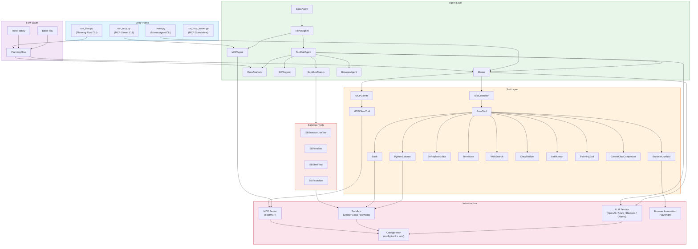
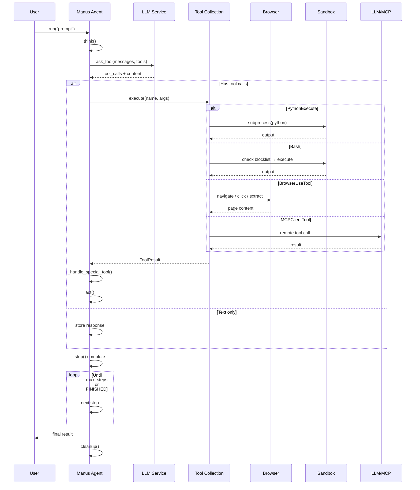

<p align="center">
  
</p>

[English](README.md) | [中文](README_zh.md) | 한국어 | [日本語](README_ja.md)

[](https://github.com/FoundationAgents/OpenManus/stargazers)
&ensp;
[](https://opensource.org/licenses/MIT) &ensp;
[](https://discord.gg/DYn29wFk9z)
[](https://huggingface.co/spaces/lyh-917/OpenManusDemo)
[](https://doi.org/10.5281/zenodo.15186407)

# 👋 OpenManus

Manus는 놀라운 도구지만, OpenManus는 *초대 코드* 없이도 모든 아이디어를 실현할 수 있습니다! 🛫

우리 팀의 멤버인 [@Xinbin Liang](https://github.com/mannaandpoem)와 [@Jinyu Xiang](https://github.com/XiangJinyu) (핵심 작성자), 그리고 [@Zhaoyang Yu](https://github.com/MoshiQAQ), [@Jiayi Zhang](https://github.com/didiforgithub), [@Sirui Hong](https://github.com/stellaHSR)이 함께 했습니다. 우리는 [@MetaGPT](https://github.com/geekan/MetaGPT)로부터 왔습니다. 프로토타입은 단 3시간 만에 출시되었으며, 계속해서 발전하고 있습니다!

이 프로젝트는 간단한 구현에서 시작되었으며, 여러분의 제안, 기여 및 피드백을 환영합니다!

OpenManus를 통해 여러분만의 에이전트를 즐겨보세요!

또한 [OpenManus-RL](https://github.com/OpenManus/OpenManus-RL)을 소개하게 되어 기쁩니다. OpenManus와 UIUC 연구자들이 공동 개발한 이 오픈소스 프로젝트는 LLM 에이전트에 대해 강화 학습(RL) 기반 (예: GRPO) 튜닝 방법을 제공합니다.

## 프로젝트 데모

<video src="https://private-user-images.githubusercontent.com/61239030/420168772-6dcfd0d2-9142-45d9-b74e-d10aa75073c6.mp4?jwt=eyJhbGciOiJIUzI1NiIsInR5cCI6IkpXVCJ9.eyJpc3MiOiJnaXRodWIuY29tIiwiYXVkIjoicmF3LmdpdGh1YnVzZXJjb250ZW50LmNvbSIsImtleSI6ImtleTUiLCJleHAiOjE3NDEzMTgwNTksIm5iZiI6MTc0MTMxNzc1OSwicGF0aCI6Ii82MTIzOTAzMC80MjAxNjg3NzItNmRjZmQwZDItOTE0Mi00NWQ5LWI3NGUtZDEwYWE3NTA3M2M2Lm1wND9YLUFtei1BbGdvcml0aG09QVdTNC1ITUFDLVNIQTI1NiZYLUFtei1DcmVkZW50aWFsPUFLSUFWQ09EWUxTQTUzUFFLNFpBJTJGMjAyNTAzMDclMkZ1cy1lYXN0LTElMkZzMyUyRmF3czRfcmVxdWVzdCZYLUFtei1EYXRlPTIwMjUwMzA3VDAzMjIzOVomWC1BbXotRXhwaXJlcz0zMDAmWC1BbXotU2lnbmF0dXJlPTdiZjFkNjlmYWNjMmEzOTliM2Y3M2VlYjgyNDRlZDJmOWE3NWZhZjE1MzhiZWY4YmQ3NjdkNTYwYTU5ZDA2MzYmWC1BbXotU2lnbmVkSGVhZGVycz1ob3N0In0.UuHQCgWYkh0OQq9qsUWqGsUbhG3i9jcZDAMeHjLt5T4" data-canonical-src="https://private-user-images.githubusercontent.com/61239030/420168772-6dcfd0d2-9142-45d9-b74e-d10aa75073c6.mp4?jwt=eyJhbGciOiJIUzI1NiIsInR5cCI6IkpXVCJ9.eyJpc3MiOiJnaXRodWIuY29tIiwiYXVkIjoicmF3LmdpdGh1YnVzZXJjb250ZW50LmNvbSIsImtleSI6ImtleTUiLCJleHAiOjE3NDEzMTgwNTksIm5iZiI6MTc0MTMxNzc1OSwicGF0aCI6Ii82MTIzOTAzMC80MjAxNjg3NzItNmRjZmQwZDItOTE0Mi00NWQ5LWI3NGUtZDEwYWE3NTA3M2M2Lm1wND9YLUFtei1BbGdvcml0aG09QVdTNC1ITUFDLVNIQTI1NiZYLUFtei1DcmVkZW50aWFsPUFLSUFWQ09EWUxTQTUzUFFLNFpBJTJGMjAyNTAzMDclMkZ1cy1lYXN0LTElMkZzMyUyRmF3czRfcmVxdWVzdCZYLUFtei1EYXRlPTIwMjUwMzA3VDAzMjIzOVomWC1BbXotRXhwaXJlcz0zMDAmWC1BbXotU2lnbmF0dXJlPTdiZjFkNjlmYWNjMmEzOTliM2Y3M2VlYjgyNDRlZDJmOWE3NWZhZjE1MzhiZWY4YmQ3NjdkNTYwYTU5ZDA2MzYmWC1BbXotU2lnbmVkSGVhZGVycz1ob3N0In0.UuHQCgWYkh0OQq9qsUWqGsUbhG3i9jcZDAMeHjLt5T4" controls="controls" muted="muted" class="d-block rounded-bottom-2 border-top width-fit" style="max-height:640px; min-height: 200px"></video>

## 설치 방법

두 가지 설치 방법을 제공합니다. **방법 2 (uv 사용)** 이 더 빠른 설치와 효율적인 종속성 관리를 위해 권장됩니다.

### 방법 1: conda 사용

1. 새로운 conda 환경을 생성합니다:

```bash
conda create -n open_manus python=3.12
conda activate open_manus
```

2. 저장소를 클론합니다:

```bash
git clone https://github.com/FoundationAgents/OpenManus.git
cd OpenManus
```

3. 종속성을 설치합니다:

```bash
pip install -r requirements.txt
```

### 방법 2: uv 사용 (권장)

1. uv를 설치합니다. (빠른 Python 패키지 설치 및 종속성 관리 도구):

```bash
curl -LsSf https://astral.sh/uv/install.sh | sh
```

2. 저장소를 클론합니다:

```bash
git clone https://github.com/FoundationAgents/OpenManus.git
cd OpenManus
```

3. 새로운 가상 환경을 생성하고 활성화합니다:

```bash
uv venv --python 3.12
source .venv/bin/activate  # Unix/macOS의 경우
# Windows의 경우:
# .venv\Scripts\activate
```

4. 종속성을 설치합니다:

```bash
uv pip install -r requirements.txt
```

### 브라우저 자동화 도구 (선택사항)
```bash
playwright install
```

## 설정 방법

OpenManus를 사용하려면 사용하는 LLM API에 대한 설정이 필요합니다. 아래 단계를 따라 설정을 완료하세요:

1. `config` 디렉토리에 `config.toml` 파일을 생성하세요 (예제 파일을 복사하여 사용할 수 있습니다):

```bash
cp config/config.example.toml config/config.toml
```

2. `config/config.toml` 파일을 편집하여 API 키를 추가하고 설정을 커스터마이징하세요:

```toml
# 전역 LLM 설정
[llm]
model = "gpt-4o"
base_url = "https://api.openai.com/v1"
api_key = "sk-..."  # 실제 API 키로 변경하세요
max_tokens = 4096
temperature = 0.0

# 특정 LLM 모델에 대한 선택적 설정
[llm.vision]
model = "gpt-4o"
base_url = "https://api.openai.com/v1"
api_key = "sk-..."  # 실제 API 키로 변경하세요
```

## 빠른 시작

OpenManus를 실행하는 한 줄 명령어:

```bash
python main.py
```

이후 터미널에서 아이디어를 작성하세요!

MCP 도구 버전을 사용하려면 다음을 실행하세요:
```bash
python run_mcp.py
```

불안정한 멀티 에이전트 버전을 실행하려면 다음을 실행할 수 있습니다:

```bash
python run_flow.py
```

### 사용자 정의 다중 에이전트 추가

현재 일반 OpenManus 에이전트 외에도 데이터 분석 및 데이터 시각화 작업에 적합한 DataAnalysis 에이전트를 통합했습니다. 이 에이전트를 `config.toml`의 `run_flow`에 추가할 수 있습니다.

```toml
# run-flow에 대한 선택적 구성
[runflow]
use_data_analysis_agent = true     # 기본적으로 비활성화되어 있으며, 활성화하려면 true로 변경
```

또한, 에이전트가 제대로 작동하도록 관련 종속성을 설치해야 합니다: [상세 설치 가이드](app/tool/chart_visualization/README.md##Installation)

---

## 🚀 프로젝트 venv로 실행 (권장)

시스템에 다른 Python(예: Python 3.14)이 전역으로 설치되어 있어 `PYTHONPATH`가 프로젝트의 가상 환경을 방해한다면, 프로젝트 venv를 활성화하고 **먼저 `PYTHONPATH`를 지우세요**:

```bash
cd OpenManus
unset PYTHONPATH
source .venv/bin/activate
python main.py
```

이 반복 작업을 피하기 위해 두 개의 헬퍼 스크립트가 포함되어 있습니다:

| 스크립트 | 용도 |
|---|---|
| `activate_openmanus.sh` | `PYTHONPATH`를 지우고 프로젝트 venv를 활성화 |
| `run_agent_test.sh` | venv를 활성화하고 테스트 프롬프트로 `main.py`를 실행 (사용자 지정 가능) |

```bash
# 환경 활성화 (PYTHONPATH 해제 + venv)
source activate_openmanus.sh

# 기본 테스트 프롬프트로 에이전트 실행
./run_agent_test.sh

# 사용자 지정 프롬프트로 에이전트 실행
./run_agent_test.sh "바다에 대한 하이쿠를 써 줘"
```

### 편의 별칭

`~/.bashrc`(또는 `~/.zshrc`)에 추가하세요:

```bash
# OpenManus: 환경 정리 + 프로젝트 venv (activate_openmanus.sh 재사용)
alias om="cd ~/OpenManus && source activate_openmanus.sh"

# 테스트 프롬프트로 에이전트 실행
alias omtest="~/OpenManus/run_agent_test.sh"
```

`source ~/.bashrc` 후 사용법:

```bash
om          # 깨끗한 venv로 프로젝트 진입
omtest      # 기본 테스트 프롬프트로 에이전트 실행
```

### OpenRouter 연결 테스트 실행

`test_openrouter.py`는 연결을 검증하고, 사용 가능한 모델을 나열하며, 추적 헤더(`HTTP-Referer` / `X-Title`)가 전송되는지 확인합니다:

```bash
# OPENROUTER_API_KEY / LLM_API_KEY 환경 변수 또는 프로젝트 루트의
# .env 파일에서 키를 읽습니다 (config/config.toml은 읽지 않음)
export OPENROUTER_API_KEY=sk-or-v1-...   # .env에 없으면 필수
unset PYTHONPATH && ./.venv/bin/python test_openrouter.py
```

OpenRouter 추적 헤더는 `config.toml`(`http_referer` / `x_title`) 또는 `OPENROUTER_HTTP_REFERER` / `OPENROUTER_X_TITLE` 환경 변수로 구성할 수 있습니다 — [`.env.example`](.env.example) 참조.

### OpenRouter 키 및 구성 유틸리티

다음 Python 유틸리티는 위의 OpenRouter 설정을 자동화합니다. 어떤 것도 키를 하드코딩하거나 전체 키를 출력하지 않습니다 — 마스킹된 접두사, 길이 및 체크섬만 출력합니다 (각 행에 키 출처가 명시됨):

| 스크립트 | 용도 |
|---|---|
| `insert_openrouter_key.py` | **base64 인코딩 키**(채팅 시크릿 마스킹 우회)에서 `.env`의 `OPENROUTER_API_KEY`를 삽입/업데이트; `sk-or-v1-` 형식을 검증하고 `0600` 권한으로 파일을 기록; `--verify`는 OpenRouter API에 대해 키를 실시간 확인 |
| `update_openrouter_config.py` | 기본/비전 모델을 설정하고 `.env`의 실제 키를 `config/config.toml`로 복사 (기록 전 TOML 검증; 멱등 — 재실행 안전) |
| `test_ask_tool_models.py` | `ask_tool`을 통해 **실제 Manus 도구 페이로드**로 후보(무료) 모델을 재테스트 (키는 config → 환경 변수 / `.env`로 읽음), 에이전트 도구 스키마를 거부하지 않는 모델 선택 |

```bash
# 1. base64에서 .env로 키 삽입 (argv 또는 stdin; --verify는 실시간 API 확인 추가)
echo 'BASE64_DA_CHAVE' | ./.venv/bin/python insert_openrouter_key.py
./.venv/bin/python insert_openrouter_key.py --verify 'BASE64_DA_CHAVE'

# 2. config.toml을 작동하는 무료 모델 + 실제 키로 설정
unset PYTHONPATH && ./.venv/bin/python update_openrouter_config.py

# 3. 실제 에이전트 페이로드로 후보 모델 재검증
unset PYTHONPATH && ./.venv/bin/python test_ask_tool_models.py
```

---

## 🤖 OpenCode와 OpenRouter 사용하기

[OpenCode](https://opencode.ai)는 터미널 AI 코딩 어시스턴트입니다. OpenRouter와 함께 사용하는 방법:

### 1. 설치

```bash
curl -fsSL https://opencode.ai/install | bash
export PATH=$HOME/.opencode/bin:$PATH   # ~/.bashrc에 추가
```

### 2. 인증

```bash
opencode auth login -p openrouter
# 프롬프트가 나타나면 OpenRouter API 키 (sk-or-v1-...)를 붙여넣으세요
```

> OpenRouter 키는 **항상 `sk-or-v1-`로 시작합니다**. 다른 형식의 키는 `401 Missing Authentication header`로 거부됩니다. <https://openrouter.ai/settings/keys>에서 생성하세요.

자격 증명은 `~/.local/share/opencode/auth.json`에 저장됩니다. 다음과 같이 확인하거나 제거할 수 있습니다:

```bash
opencode auth list      # 구성된 공급자 표시
opencode auth logout openrouter   # 자격 증명 제거 (예: 재로그인)
```

또는 OpenCode는 `OPENROUTER_API_KEY` 환경 변수를 자동 감지합니다 — 로그인 불필요:

```bash
export OPENROUTER_API_KEY=sk-or-v1-...
```

### 3. 실행

```bash
# 일회성 프롬프트 (비대화형 — 스크립트에 권장)
echo 'Diga apenas a palavra OK' | opencode run --model openrouter/openai/gpt-4o-mini 'Diga apenas a palavra OK'

# 대화형 세션
opencode
```

> **참고:** stdin 파이프 없이 `opencode run`을 실행하면 대화형 TUI가 열립니다. 스크립팅할 때는 파이프(`echo ... | opencode run ...`)를 사용하세요.

---

## 🏗️ 아키텍처

OpenManus는 **계층적이고 모듈화된 아키텍처**를 따르며 관심사를 명확히 분리합니다:



### 🧬 컴포넌트 계층 구조

```
BaseAgent (abstract)
 └── ReActAgent (think → act loop)
      ├── ToolCallAgent (tool/function calling)
      │    ├── Manus (general-purpose with MCP)
      │    ├── DataAnalysis (data visualization)
      │    ├── SWEAgent (software engineering)
      │    ├── SandboxManus (sandbox-isolated)
      │    └── BrowserAgent (browser-specific)
      └── MCPAgent (MCP protocol agent)
```

### 📁 프로젝트 구조

```
OpenManus/
├── main.py                    # Entry point: Manus agent CLI
├── run_flow.py                # Multi-agent planning flow
├── run_mcp.py                 # MCP agent runner
├── run_mcp_server.py          # Standalone MCP server
├── sandbox_main.py            # Sandbox agent runner
│
├── app/
│   ├── agent/                 # Agent implementations
│   │   ├── base.py            #   BaseAgent (ABC)
│   │   ├── react.py           #   ReActAgent (think→act)
│   │   ├── toolcall.py        #   ToolCallAgent
│   │   ├── manus.py           #   Manus (flagship agent)
│   │   ├── browser.py         #   BrowserAgent
│   │   ├── data_analysis.py   #   DataAnalysisAgent
│   │   ├── swe.py             #   SWEAgent
│   │   ├── mcp.py             #   MCPAgent
│   │   └── sandbox_agent.py   #   SandboxManus
│   │
│   ├── tool/                  # Tool implementations
│   │   ├── base.py            #   BaseTool (ABC)
│   │   ├── tool_collection.py #   ToolCollection
│   │   ├── python_execute.py  #   Isolated code execution
│   │   ├── bash.py            #   Terminal with blocklist
│   │   ├── browser_use_tool.py#   Browser automation
│   │   ├── str_replace_editor.py# File editing
│   │   ├── mcp.py             #   MCP client tools
│   │   ├── web_search.py      #   Multi-engine search
│   │   ├── crawl4ai.py        #   Web crawling
│   │   ├── terminate.py       #   Termination tool
│   │   ├── planning.py        #   Planning tool
│   │   └── sandbox/           #   Sandbox-specific tools
│   │
│   ├── flow/                  # Orchestration flows
│   │   ├── base.py            #   BaseFlow
│   │   ├── flow_factory.py    #   FlowFactory
│   │   └── planning.py        #   PlanningFlow (step exec)
│   │
│   ├── mcp/                   # MCP protocol server
│   │   └── server.py          #   FastMCP-based server
│   │
│   ├── daytona/               # Daytona sandbox client
│   │   ├── client.py          #   Shared init (lazy)
│   │   ├── sandbox.py         #   CRUD operations
│   │   └── tool_base.py       #   SandboxToolsBase
│   │
│   ├── sandbox/               # Local Docker sandbox
│   │   ├── client.py          #   LocalSandboxClient
│   │   └── core/              #   Manager, terminal
│   │
│   ├── prompt/                # System prompts
│   ├── config.py              # Singleton config loader
│   ├── llm.py                 # LLM service + rate limiter
│   ├── schema.py              # Data models
│   ├── logger.py              # Logging
│   └── exceptions.py          # Custom exceptions
│
├── config/
│   ├── config.example.toml    # Config template
│   └── mcp.example.json       # MCP server config
│
├── tests/                     # Test suite (61+ tests)
│   ├── conftest.py
│   ├── test_toolcall_agent.py # 22 tests
│   ├── test_manus_agent.py    # 14 tests
│   ├── test_python_execute.py # 11 tests
│   └── test_bash_tool.py      # 14 tests
│
└── .env.example               # Environment variables template
```

---

## 🔄 데이터 흐름



---

## 🔒 보안 기능

OpenManus는 여러 Sprint에 걸쳐 구현된 여러 보안 조치를 포함합니다:

### 1. 자격 증명 관리
- **API 키는 환경 변수에서 읽습니다** (`LLM_API_KEY`, `PROXY_PASSWORD`, `VNC_PASSWORD`)
- `python-dotenv`를 통한 `.env` 파일 지원
- **소스 코드에 하드코딩된 자격 증명 없음**

### 2. 코드 실행 안전
- `PythonExecute`는 `exec()`가 아닌 **격리된 하위 프로세스**(`create_subprocess_exec`)에서 실행됩니다
- 내장 타임아웃이 통제 불능 실행을 방지
- 깔끔한 stdout/stderr 캡처

### 3. 셸 명령 차단 목록
`Bash` 도구는 `_check_blocked_commands()`를 통해 파괴적인 명령을 차단합니다:

| 차단된 패턴 | 예시 |
|---|---|
| `rm -rf /` 또는 `rm -rf ~` | 루트 재귀 삭제 |
| `mkfs.*` | 파일 시스템 포맷 |
| `dd if=` | 원시 디스크 쓰기 |
| `chmod 777 /` | 권한 상승 |
| 포크 폭탄 | `:(){ :|:& };:` |
| `reboot`, `shutdown`, `halt` | 시스템 제어 |

### 4. 브라우저 안전
- 기본값: **헤드리스 모드**(`headless=True`)
- **보안 기능 활성화**(`disable_security=False`)
- `BrowserSettings`로 구성 가능

### 5. 속도 제한
- `LLM` 서비스에 내장된 `RateLimiter`
- 시간 창당 최대 호출 수 구성 가능
- `asyncio.Lock`을 통한 비동기 안전

---

## 🛡️ 비밀 스캔 (GitGuardian / ggshield)

비밀(API 키, 토큰, 비밀번호)은 절대 저장소에 도달해서는 안 됩니다. 이 프로젝트는 **GitGuardian ggshield**를 **세 가지 보완 계층**으로 사용합니다:

### 1. 로컬 pre-commit / pre-push 차단

`ggshield`는 **로컬 pre-commit 훅**으로 등록되며(`.pre-commit-config.yaml` 참조), 비밀이 포함된 커밋과 푸시는 **원격에 도달하기 전에 차단됩니다**:

```bash
# ggshield 설치 (독립 실행 바이너리, sudo 불필요) - 릴리스 페이지에서
# 현재 버전 확인: https://github.com/GitGuardian/ggshield/releases
curl -fsSL https://github.com/GitGuardian/ggshield/releases/latest/download/ggshield-1.53.0-x86_64-unknown-linux-gnu.tar.gz -o /tmp/ggshield.tar.gz && tar xzf /tmp/ggshield.tar.gz -C /tmp && cp /tmp/ggshield-1.53.0-x86_64-unknown-linux-gnu/ggshield ~/.local/bin/ && chmod +x ~/.local/bin/ggshield
# 대안 (항상 최신): pipx install ggshield

# 인증 (비밀 스캔에 필요):
export GITGUARDIAN_API_KEY=your-gitguardian-api-key   # 또는: ggshield auth login

# 훅 설치 (pre-commit + pre-push 등록):
pre-commit install
pre-commit install --hook-type pre-push
```

> `GITGUARDIAN_API_KEY`가 설정되지 않으면 훅은 **깨끗하게 건너뜁니다**. 인증 전에는 개발을 절대 차단하지 않습니다.

### 2. CI/CD 통합 (GitHub Actions)

`.github/workflows/secret-scan.yaml`은 `main` 브랜치의 **모든 push, 모든 pull request, 매일(cron)** 마다 `ggshield secret scan`을 실행합니다.

GitHub 저장소에서 활성화하려면:

1. GitGuardian 계정 생성 → [dashboard.gitguardian.com](https://dashboard.gitguardian.com)
2. API 토큰 생성: **Settings → API → Create a new token**(`scan` 범위)
3. 저장소 비밀로 추가: **Settings → Secrets and variables → Actions → New repository secret** → 이름 `GITGUARDIAN_API_KEY`
4. 비밀이 설정될 때까지 워크플로는 스캔 단계를 실행하지 않을 뿐입니다(실패 없음)

### 3. 저장소 연결 및 지속적 커밋 스캔 (GitGuardian 대시보드)

**푸시된 모든 커밋(기록 포함)의 지속적 스캔**을 위해 저장소를 GitGuardian 대시보드에 연결하세요:

1. 대시보드에서: **Repositories → Add repository**(또는 *Install on GitHub/GitLab*)
2. GitGuardian이 저장소에 접근하도록 승인 (GitHub는 GitHub App, GitLab은 통합)
3. GitGuardian이 **전체 기록**과 모든 향후 커밋을 자동으로 스캔합니다

### 4. 알림 및 사고 담당자

대시보드에서 누가 알림을 받고 누가 수정을 담당하는지 구성하세요:

| 설정 | 위치 | 권장 사항 |
|---|---|---|
| **알림 채널** | Settings → Alerting | 이메일 + Slack/Teams 웹훅 (사고, 높은 심각도만) |
| **사고 담당자** | Settings → Incident management → Assignees | 저장소/팀별 담당자 지정, **자동 할당** 활성화 |
| **심각도 규칙** | Settings → Incident management → Rules | 감지기/심각도별 자동 할당 (예: 모든 `OpenAI API Key` → 보안 팀) |
| **수정 워크플로** | Dashboard → Incident | 유출된 비밀을 즉시 회전시키고 수정 사항을 푸시 |

**사고 대응 체크리스트:**

1. **유출된 비밀을 즉시 회전/폐기** (공급자에서)
2. 저장소에서 제거: `git filter-repo` 또는 BFG, 이후 강제 푸시
3. 재스캔하여 결과 0건 확인
4. 대시보드에서 담당자/할당자 상태 업데이트

---

## 🧪 테스트

테스트는 `tests/` 디렉터리에 구성되며 `pytest`와 `pytest-asyncio`를 사용합니다:

```bash
# 모든 테스트 실행
python -m pytest tests/ -v

# 특정 테스트 파일 실행
python -m pytest tests/test_toolcall_agent.py -v

# 커버리지 리포트와 함께 실행
python -m pytest tests/ --cov=app --cov-report=term-missing
```

### 테스트 커버리지 (75개 테스트)

| 테스트 파일 | 테스트 수 | 커버 내용 |
|---|---|---|
| `test_toolcall_agent.py` | 22 | 생각/행동 주기, 도구 호출, 경계 사례, 오류 처리 |
| `test_manus_agent.py` | 14 | 팩토리 생성, MCP 초기화, 브라우저 컨텍스트, 정리 |
| `test_python_execute.py` | 11 | 하위 프로세스 격리, 타임아웃, 구문/런타임 오류 |
| `test_bash_tool.py` | 14 | 기본 실행, 보안 차단 목록(7개 패턴), 안전한 명령 |
| `test_search_cache.py` | 14 | TTL 캐시, 메트릭 수집기, 검색 결과 검증 |

---

## 🛣️ 로드맵

| Sprint | 초점 | 상태 |
|---|---|---|
| **Sprint 1** | 🔒 보안: 환경 변수, 하위 프로세스 격리, bash 차단 목록, 브라우저 안전 | ✅ 완료 |
| **Sprint 2** | 🧪 테스트: 모든 핵심 구성 요소에 걸친 61개 테스트 | ✅ 완료 |
| **Sprint 3** | 🎯 품질: Daytona 통합, 죽은 코드 제거, 속도 제한 | ✅ 완료 |
| **Sprint 4** | 📖 문서: 아키텍처 다이어그램, 프로젝트 구조 문서 | ✅ 완료 |
| **Sprint 5** | ⚙️ CI/CD: GitHub Actions 파이프라인 (테스트, lint, 구문) | ✅ 완료 |
| **Sprint 6** | ⚡ 성능: 검색 캐시, 메트릭 수집기, 관찰 가능성 | ✅ 완료 |

---

## 🛠️ 개발

### Pre-commit

풀 리퀘스트를 제출하기 전에 pre-commit 검사를 실행하세요:

```bash
pre-commit run --all-files
```

### 새 도구 추가

1. `app/tool/`에 `BaseTool`에서 상속하는 새 클래스 생성
2. `name`, `description`, `parameters`(JSON Schema) 정의
3. `execute()` 메서드 구현
4. `app/tool/__init__.py`에 추가
5. 기본으로 제공해야 한다면 Manus 에이전트에 추가

### 새 에이전트 추가

1. `ToolCallAgent`에서 상속 (더 단순한 에이전트는 `ReActAgent`)
2. 필요에 따라 `think()` 및/또는 `act()` 재정의
3. `app/prompt/`에 시스템 프롬프트 정의
4. 해당 진입점(`main.py`, `run_flow.py`)에 등록

---

## 기여 방법

모든 친절한 제안과 유용한 기여를 환영합니다! 이슈를 생성하거나 풀 리퀘스트를 제출해 주세요.

또는 📧 메일로 연락주세요. @mannaandpoem : mannaandpoem@gmail.com

**참고**: pull request를 제출하기 전에 pre-commit 도구를 사용하여 변경 사항을 확인하십시오. `pre-commit run --all-files`를 실행하여 검사를 실행합니다.

## 커뮤니티 그룹
Feishu 네트워킹 그룹에 참여하여 다른 개발자들과 경험을 공유하세요!

<div align="center" style="display: flex; gap: 20px;">
    
</div>

## Star History

[](https://star-history.com/#FoundationAgents/OpenManus&Date)

## 스폰서
[PPIO](https://ppinfra.com/user/register?invited_by=OCPKCN&utm_source=github_openmanus&utm_medium=github_readme&utm_campaign=link)의 컴퓨팅 리소스 지원에 감사드립니다.
> PPIO: 가장 경제적이고 통합하기 쉬운 MaaS 및 GPU 클라우드 솔루션

## 감사의 글

이 프로젝트에 기본적인 지원을 제공해 주신 [anthropic-computer-use](https://github.com/anthropics/anthropic-quickstarts/tree/main/computer-use-demo)와
[browser-use](https://github.com/browser-use/browser-use)에게 감사드립니다!

또한, [AAAJ](https://github.com/metauto-ai/agent-as-a-judge), [MetaGPT](https://github.com/geekan/MetaGPT), [OpenHands](https://github.com/All-Hands-AI/OpenHands), [SWE-agent](https://github.com/SWE-agent/SWE-agent)에 깊은 감사를 드립니다.

또한 Hugging Face 데모 공간을 지원해 주신 阶跃星辰 (stepfun)에게 감사드립니다.

OpenManus는 MetaGPT 기여자들에 의해 개발되었습니다. 이 에이전트 커뮤니티에 깊은 감사를 전합니다!

## 🎮 교육용 HTML 자료

이 저장소에는 역사 교육용(BNCC 정렬, 6-9학년) 독립형 HTML 교육 리소스가 여러 개 포함되어 있습니다:

### 🃏 메모리 게임

| 파일 | 테마 | 페어 | 사운드 | 학년 |
|---|---|---|---|---|
| `jogo_memoria_reforma.html` | 종교 개혁 | 12페어 | ✅ Web Audio API | 7학년 |
| `jogo_memoria_brasil_colonia.html` | 식민지 브라질 | 20페어 | ✅ Web Audio API | 7-8학년 |
| `jogo_memoria_holandesas_digital.html` | 네덜란드 침공 | 16페어 | ✅ Web Audio API | 7-8학년 |
| `jogo_memoria_holandesas.html` | 네덜란드 침공 (인쇄) | 8페어 | 🖨️ 인쇄 친화적 | 7-8학년 |

### 🧠 역사 퀴즈 (React + Tailwind)

| 파일 | 문제 수 | 테마 | 기능 |
|---|---|---|---|
| `quiz_historico.html` 🇧🇷 | **311문제** | 42개 테마 (6-9학년) | 3가지 모드 (학습/퀴즈/타이머), 12개 업적, SoundFX, BNCC 코드 |
| `quiz_historico_en.html` 🇺🇸 | **311문제** | 42개 테마 (6-9학년) | 동일 기능, 영어로 완전 번역 |

### 📊 학교 관리 시스템

| 파일 | 설명 | 기술 |
|---|---|---|
| `gestao_escolar.html` | 주간 그리드, 보고서, JSON 백업, 점유 대시보드 | Vanilla HTML/CSS/JS |
| `escola_organizada.html` | 공간 일정, 로그인, 충돌 감지, CSV 내보내기 | React + Tailwind |

### 🤖 로컬 AI 에이전트

| 파일 | 설명 |
|---|---|
| `agente_ollama.py` | Ollama 함수 호출이 포함된 10-도구 로컬 에이전트 |
| `guia_agente_local_ollama.md` | 나만의 로컬 에이전트를 만드는 단계별 가이드 |

모든 HTML 파일은 **제로 의존성**(브라우저에서 직접 열림)이거나 **CDN**(React, Tailwind)을 사용합니다.

---

## 인용
```bibtex
@misc{openmanus2025,
  author = {Xinbin Liang and Jinyu Xiang and Zhaoyang Yu and Jiayi Zhang and Sirui Hong and Sheng Fan and Xiao Tang},
  title = {OpenManus: An open-source framework for building general AI agents},
  year = {2025},
  publisher = {Zenodo},
  doi = {10.5281/zenodo.15186407},
  url = {https://doi.org/10.5281/zenodo.15186407},
}
```
