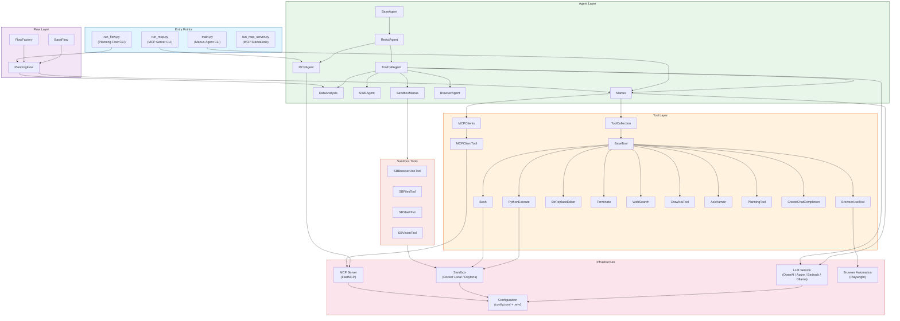
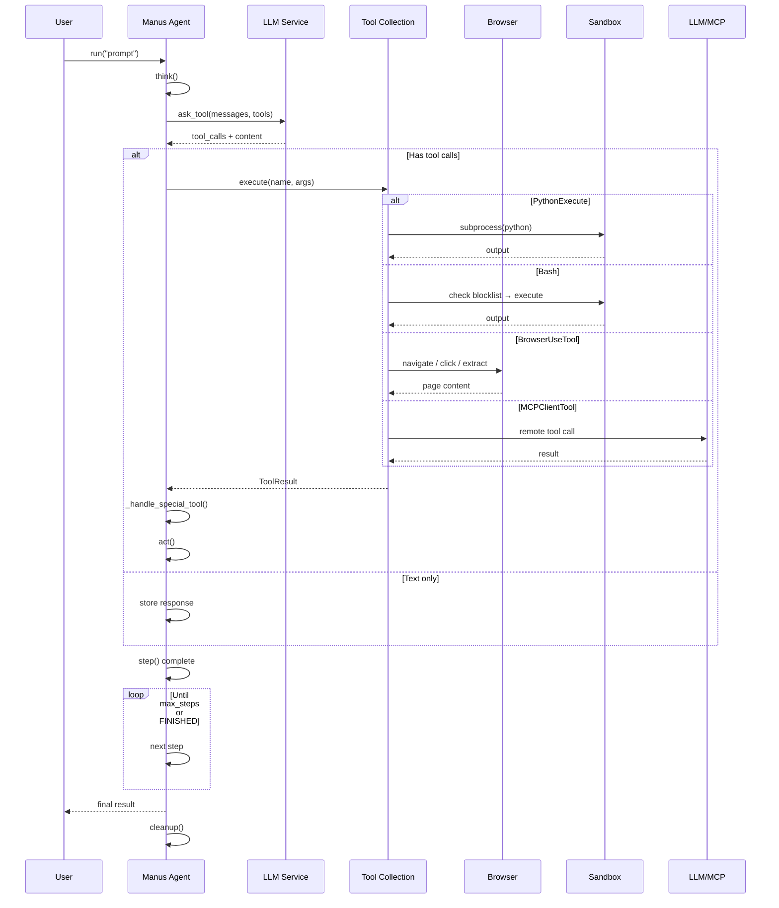

<p align="center">
  
</p>

[English](README.md) | 中文 | [한국어](README_ko.md) | [日本語](README_ja.md)

[](https://github.com/FoundationAgents/OpenManus/stargazers)
&ensp;
[](https://opensource.org/licenses/MIT) &ensp;
[](https://discord.gg/DYn29wFk9z)
[](https://huggingface.co/spaces/lyh-917/OpenManusDemo)
[](https://doi.org/10.5281/zenodo.15186407)

# 👋 OpenManus

Manus 非常棒，但 OpenManus 无需邀请码即可实现任何创意 🛫！

我们的团队成员 [@Xinbin Liang](https://github.com/mannaandpoem) 和 [@Jinyu Xiang](https://github.com/XiangJinyu)（核心作者），以及 [@Zhaoyang Yu](https://github.com/MoshiQAQ)、[@Jiayi Zhang](https://github.com/didiforgithub) 和 [@Sirui Hong](https://github.com/stellaHSR)，来自 [@MetaGPT](https://github.com/geekan/MetaGPT)团队。我们在 3
小时内完成了开发并持续迭代中！

这是一个简洁的实现方案，欢迎任何建议、贡献和反馈！

用 OpenManus 开启你的智能体之旅吧！

我们也非常高兴地向大家介绍 [OpenManus-RL](https://github.com/OpenManus/OpenManus-RL)，这是一个专注于基于强化学习（RL，例如 GRPO）的方法来优化大语言模型（LLM）智能体的开源项目，由来自UIUC 和 OpenManus 的研究人员合作开发。

## 项目演示

<video src="https://private-user-images.githubusercontent.com/61239030/420168772-6dcfd0d2-9142-45d9-b74e-d10aa75073c6.mp4?jwt=eyJhbGciOiJIUzI1NiIsInR5cCI6IkpXVCJ9.eyJpc3MiOiJnaXRodWIuY29tIiwiYXVkIjoicmF3LmdpdGh1YnVzZXJjb250ZW50LmNvbSIsImtleSI6ImtleTUiLCJleHAiOjE3NDEzMTgwNTksIm5iZiI6MTc0MTMxNzc1OSwicGF0aCI6Ii82MTIzOTAzMC80MjAxNjg3NzItNmRjZmQwZDItOTE0Mi00NWQ5LWI3NGUtZDEwYWE3NTA3M2M2Lm1wND9YLUFtei1BbGdvcml0aG09QVdTNC1ITUFDLVNIQTI1NiZYLUFtei1DcmVkZW50aWFsPUFLSUFWQ09EWUxTQTUzUFFLNFpBJTJGMjAyNTAzMDclMkZ1cy1lYXN0LTElMkZzMyUyRmF3czRfcmVxdWVzdCZYLUFtei1EYXRlPTIwMjUwMzA3VDAzMjIzOVomWC1BbXotRXhwaXJlcz0zMDAmWC1BbXotU2lnbmF0dXJlPTdiZjFkNjlmYWNjMmEzOTliM2Y3M2VlYjgyNDRlZDJmOWE3NWZhZjE1MzhiZWY4YmQ3NjdkNTYwYTU5ZDA2MzYmWC1BbXotU2lnbmVkSGVhZGVycz1ob3N0In0.UuHQCgWYkh0OQq9qsUWqGsUbhG3i9jcZDAMeHjLt5T4" data-canonical-src="https://private-user-images.githubusercontent.com/61239030/420168772-6dcfd0d2-9142-45d9-b74e-d10aa75073c6.mp4?jwt=eyJhbGciOiJIUzI1NiIsInR5cCI6IkpXVCJ9.eyJpc3MiOiJnaXRodWIuY29tIiwiYXVkIjoicmF3LmdpdGh1YnVzZXJjb250ZW50LmNvbSIsImtleSI6ImtleTUiLCJleHAiOjE3NDEzMTgwNTksIm5iZiI6MTc0MTMxNzc1OSwicGF0aCI6Ii82MTIzOTAzMC80MjAxNjg3NzItNmRjZmQwZDItOTE0Mi00NWQ5LWI3NGUtZDEwYWE3NTA3M2M2Lm1wND9YLUFtei1BbGdvcml0aG09QVdTNC1ITUFDLVNIQTI1NiZYLUFtei1DcmVkZW50aWFsPUFLSUFWQ09EWUxTQTUzUFFLNFpBJTJGMjAyNTAzMDclMkZ1cy1lYXN0LTElMkZzMyUyRmF3czRfcmVxdWVzdCZYLUFtei1EYXRlPTIwMjUwMzA3VDAzMjIzOVomWC1BbXotRXhwaXJlcz0zMDAmWC1BbXotU2lnbmF0dXJlPTdiZjFkNjlmYWNjMmEzOTliM2Y3M2VlYjgyNDRlZDJmOWE3NWZhZjE1MzhiZWY4YmQ3NjdkNTYwYTU5ZDA2MzYmWC1BbXotU2lnbmVkSGVhZGVycz1ob3N0In0.UuHQCgWYkh0OQq9qsUWqGsUbhG3i9jcZDAMeHjLt5T4" controls="controls" muted="muted" class="d-block rounded-bottom-2 border-top width-fit" style="max-height:640px; min-height: 200px"></video>

## 安装指南

我们提供两种安装方式。推荐使用方式二（uv），因为它能提供更快的安装速度和更好的依赖管理。

### 方式一：使用 conda

1. 创建新的 conda 环境：

```bash
conda create -n open_manus python=3.12
conda activate open_manus
```

2. 克隆仓库：

```bash
git clone https://github.com/FoundationAgents/OpenManus.git
cd OpenManus
```

3. 安装依赖：

```bash
pip install -r requirements.txt
```

### 方式二：使用 uv（推荐）

1. 安装 uv（一个快速的 Python 包管理器）：

```bash
curl -LsSf https://astral.sh/uv/install.sh | sh
```

2. 克隆仓库：

```bash
git clone https://github.com/FoundationAgents/OpenManus.git
cd OpenManus
```

3. 创建并激活虚拟环境：

```bash
uv venv --python 3.12
source .venv/bin/activate  # Unix/macOS 系统
# Windows 系统使用：
# .venv\Scripts\activate
```

4. 安装依赖：

```bash
uv pip install -r requirements.txt
```

### 浏览器自动化工具（可选）
```bash
playwright install
```

## 配置说明

OpenManus 需要配置使用的 LLM API，请按以下步骤设置：

1. 在 `config` 目录创建 `config.toml` 文件（可从示例复制）：

```bash
cp config/config.example.toml config/config.toml
```

2. 编辑 `config/config.toml` 添加 API 密钥和自定义设置：

```toml
# 全局 LLM 配置
[llm]
model = "gpt-4o"
base_url = "https://api.openai.com/v1"
api_key = "sk-..."  # 替换为真实 API 密钥
max_tokens = 4096
temperature = 0.0

# 可选特定 LLM 模型配置
[llm.vision]
model = "gpt-4o"
base_url = "https://api.openai.com/v1"
api_key = "sk-..."  # 替换为真实 API 密钥
```

## 快速启动

一行命令运行 OpenManus：

```bash
python main.py
```

然后通过终端输入你的创意！

如需使用 MCP 工具版本，可运行：
```bash
python run_mcp.py
```

如需体验不稳定的多智能体版本，可运行：

```bash
python run_flow.py
```

## 添加自定义多智能体

目前除了通用的 OpenManus Agent, 我们还内置了DataAnalysis Agent，适用于数据分析和数据可视化任务，你可以在`config.toml`中将这个智能体加入到`run_flow`中
```toml
# run-flow可选配置
[runflow]
use_data_analysis_agent = true     # 默认关闭，将其改为true则为激活
```
除此之外，你还需要安装相关的依赖来确保智能体正常运行：[具体安装指南](app/tool/chart_visualization/README_zh.md##安装)


---

## 🚀 使用项目虚拟环境运行（推荐）

如果你的系统全局安装了其他版本的 Python（例如 Python 3.14），其 `PYTHONPATH` 会干扰项目的虚拟环境，请先激活项目 venv 并**清除 `PYTHONPATH`**：

```bash
cd OpenManus
unset PYTHONPATH
source .venv/bin/activate
python main.py
```

项目中包含两个辅助脚本来避免重复操作：

| 脚本 | 用途 |
|---|---|
| `activate_openmanus.sh` | 清除 `PYTHONPATH` 并激活项目虚拟环境 |
| `run_agent_test.sh` | 激活 venv 并使用测试提示词运行 `main.py`（可自定义） |

```bash
# 激活环境（清除 PYTHONPATH + venv）
source activate_openmanus.sh

# 使用默认测试提示词运行智能体
./run_agent_test.sh

# 使用自定义提示词运行智能体
./run_agent_test.sh "写一首关于大海的俳句"
```

### 便捷别名

将这些添加到你的 `~/.bashrc`（或 `~/.zshrc`）：

```bash
# OpenManus：清理环境 + 项目 venv（复用 activate_openmanus.sh）
alias om="cd ~/OpenManus && source activate_openmanus.sh"

# 使用测试提示词运行智能体
alias omtest="~/OpenManus/run_agent_test.sh"
```

`source ~/.bashrc` 之后的使用方式：

```bash
om          # 以干净的 venv 进入项目
omtest      # 使用默认测试提示词运行智能体
```

### 运行 OpenRouter 连接测试

`test_openrouter.py` 验证连接、列出可用模型，并确认跟踪头（`HTTP-Referer` / `X-Title`）已发送：

```bash
# 从 OPENROUTER_API_KEY / LLM_API_KEY 环境变量或项目根目录的
# .env 文件中读取密钥（它不会读取 config/config.toml）
export OPENROUTER_API_KEY=sk-or-v1-...   # 如果不在 .env 中则需要
unset PYTHONPATH && ./.venv/bin/python test_openrouter.py
```

OpenRouter 跟踪头可通过 `config.toml`（`http_referer` / `x_title`）或 `OPENROUTER_HTTP_REFERER` / `OPENROUTER_X_TITLE` 环境变量配置 — 参见 [`.env.example`](.env.example)。

### OpenRouter 密钥与配置工具

以下 Python 工具可自动化上述 OpenRouter 配置流程。它们都不会硬编码或打印完整密钥 — 仅输出掩码前缀、长度和校验和（每行注明密钥来源）：

| 脚本 | 用途 |
|---|---|
| `insert_openrouter_key.py` | 从 **base64 编码的密钥**（绕过聊天中的密钥屏蔽）插入/更新 `.env` 中的 `OPENROUTER_API_KEY`；验证 `sk-or-v1-` 格式并以 `0600` 权限写入文件；`--verify` 还会对 OpenRouter API 进行实时密钥检查 |
| `update_openrouter_config.py` | 设置默认/视觉模型，并将 `.env` 中的真实密钥复制到 `config/config.toml`（写入前验证 TOML；幂等 — 可安全重复运行） |
| `test_ask_tool_models.py` | 通过 `ask_tool` 使用 **真实的 Manus 工具负载** 重新测试候选（免费）模型（密钥通过 config → 环境变量 / `.env` 读取），以挑选不会拒绝智能体工具模式的模型 |

```bash
# 1. 从 base64 将密钥插入 .env（argv 或 stdin；--verify 增加实时 API 检查）
echo 'BASE64_DA_CHAVE' | ./.venv/bin/python insert_openrouter_key.py
./.venv/bin/python insert_openrouter_key.py --verify 'BASE64_DA_CHAVE'

# 2. 将 config.toml 指向可用的免费模型 + 真实密钥
unset PYTHONPATH && ./.venv/bin/python update_openrouter_config.py

# 3. 使用真实智能体负载重新验证候选模型
unset PYTHONPATH && ./.venv/bin/python test_ask_tool_models.py
```

---

## 🤖 将 OpenCode 与 OpenRouter 结合使用

[OpenCode](https://opencode.ai) 是一款终端 AI 编程助手。与 OpenRouter 结合使用的方法：

### 1. 安装

```bash
curl -fsSL https://opencode.ai/install | bash
export PATH=$HOME/.opencode/bin:$PATH   # 添加到 ~/.bashrc
```

### 2. 认证

```bash
opencode auth login -p openrouter
# 在提示时粘贴你的 OpenRouter API 密钥（sk-or-v1-...）
```

> OpenRouter 密钥**始终以 `sk-or-v1-` 开头**。其他格式的密钥会被拒绝并返回 `401 Missing Authentication header`。请在 <https://openrouter.ai/settings/keys> 创建。

凭据存储在 `~/.local/share/opencode/auth.json`。可使用以下命令查看或移除：

```bash
opencode auth list      # 显示已配置的提供商
opencode auth logout openrouter   # 移除凭据（例如重新登录）
```

另外，OpenCode 会自动检测 `OPENROUTER_API_KEY` 环境变量 — 无需登录：

```bash
export OPENROUTER_API_KEY=sk-or-v1-...
```

### 3. 运行

```bash
# 一次性提示（非交互 — 推荐用于脚本）
echo 'Diga apenas a palavra OK' | opencode run --model openrouter/openai/gpt-4o-mini 'Diga apenas a palavra OK'

# 交互式会话
opencode
```

> **注意：** 没有管道 stdin 时，`opencode run` 会打开交互式 TUI。编写脚本时请使用管道（`echo ... | opencode run ...`）。

---

## 🏗️ 架构

OpenManus 采用**分层、模块化**的架构，各关注点清晰分离：



### 🧬 组件层级

```
BaseAgent (abstract)
 └── ReActAgent (think → act loop)
      ├── ToolCallAgent (tool/function calling)
      │    ├── Manus (general-purpose with MCP)
      │    ├── DataAnalysis (data visualization)
      │    ├── SWEAgent (software engineering)
      │    ├── SandboxManus (sandbox-isolated)
      │    └── BrowserAgent (browser-specific)
      └── MCPAgent (MCP protocol agent)
```

### 📁 项目结构

```
OpenManus/
├── main.py                    # Entry point: Manus agent CLI
├── run_flow.py                # Multi-agent planning flow
├── run_mcp.py                 # MCP agent runner
├── run_mcp_server.py          # Standalone MCP server
├── sandbox_main.py            # Sandbox agent runner
│
├── app/
│   ├── agent/                 # Agent implementations
│   │   ├── base.py            #   BaseAgent (ABC)
│   │   ├── react.py           #   ReActAgent (think→act)
│   │   ├── toolcall.py        #   ToolCallAgent
│   │   ├── manus.py           #   Manus (flagship agent)
│   │   ├── browser.py         #   BrowserAgent
│   │   ├── data_analysis.py   #   DataAnalysisAgent
│   │   ├── swe.py             #   SWEAgent
│   │   ├── mcp.py             #   MCPAgent
│   │   └── sandbox_agent.py   #   SandboxManus
│   │
│   ├── tool/                  # Tool implementations
│   │   ├── base.py            #   BaseTool (ABC)
│   │   ├── tool_collection.py #   ToolCollection
│   │   ├── python_execute.py  #   Isolated code execution
│   │   ├── bash.py            #   Terminal with blocklist
│   │   ├── browser_use_tool.py#   Browser automation
│   │   ├── str_replace_editor.py# File editing
│   │   ├── mcp.py             #   MCP client tools
│   │   ├── web_search.py      #   Multi-engine search
│   │   ├── crawl4ai.py        #   Web crawling
│   │   ├── terminate.py       #   Termination tool
│   │   ├── planning.py        #   Planning tool
│   │   └── sandbox/           #   Sandbox-specific tools
│   │
│   ├── flow/                  # Orchestration flows
│   │   ├── base.py            #   BaseFlow
│   │   ├── flow_factory.py    #   FlowFactory
│   │   └── planning.py        #   PlanningFlow (step exec)
│   │
│   ├── mcp/                   # MCP protocol server
│   │   └── server.py          #   FastMCP-based server
│   │
│   ├── daytona/               # Daytona sandbox client
│   │   ├── client.py          #   Shared init (lazy)
│   │   ├── sandbox.py         #   CRUD operations
│   │   └── tool_base.py       #   SandboxToolsBase
│   │
│   ├── sandbox/               # Local Docker sandbox
│   │   ├── client.py          #   LocalSandboxClient
│   │   └── core/              #   Manager, terminal
│   │
│   ├── prompt/                # System prompts
│   ├── config.py              # Singleton config loader
│   ├── llm.py                 # LLM service + rate limiter
│   ├── schema.py              # Data models
│   ├── logger.py              # Logging
│   └── exceptions.py          # Custom exceptions
│
├── config/
│   ├── config.example.toml    # Config template
│   └── mcp.example.json       # MCP server config
│
├── tests/                     # Test suite (61+ tests)
│   ├── conftest.py
│   ├── test_toolcall_agent.py # 22 tests
│   ├── test_manus_agent.py    # 14 tests
│   ├── test_python_execute.py # 11 tests
│   └── test_bash_tool.py      # 14 tests
│
└── .env.example               # Environment variables template
```

---

## 🔄 数据流



---

## 🔒 安全特性

OpenManus 包含跨多个 Sprint 实现的若干安全措施：

### 1. 凭据管理
- **API 密钥从环境变量读取**（`LLM_API_KEY`、`PROXY_PASSWORD`、`VNC_PASSWORD`）
- 通过 `python-dotenv` 支持 `.env` 文件
- **源码中不硬编码凭据**

### 2. 代码执行安全
- `PythonExecute` 在**隔离的子进程**中运行（`create_subprocess_exec`），而非 `exec()`
- 内置超时防止失控执行
- 干净的 stdout/stderr 捕获

### 3. Shell 命令黑名单
`Bash` 工具通过 `_check_blocked_commands()` 阻止破坏性命令：

| 被阻止的模式 | 示例 |
|---|---|
| `rm -rf /` 或 `rm -rf ~` | 递归删除根目录 |
| `mkfs.*` | 文件系统格式化 |
| `dd if=` | 原始磁盘写入 |
| `chmod 777 /` | 权限提升 |
| Fork 炸弹 | `:(){ :|:& };:` |
| `reboot`、`shutdown`、`halt` | 系统控制 |

### 4. 浏览器安全
- 默认：**无头模式**（`headless=True`）
- **安全功能已启用**（`disable_security=False`）
- 可通过 `BrowserSettings` 配置

### 5. 速率限制
- `LLM` 服务内置 `RateLimiter`
- 可配置每个时间窗口的最大调用次数
- 通过 `asyncio.Lock` 实现异步安全

---

## 🛡️ 密钥扫描（GitGuardian / ggshield）

密钥（API 密钥、令牌、密码）绝不能进入代码仓库。本项目通过**三个互补层级**使用 **GitGuardian ggshield**：

### 1. 本地 pre-commit / pre-push 阻止

`ggshield` 注册为**本地 pre-commit 钩子**（参见 `.pre-commit-config.yaml`），因此包含密钥的提交和推送会在**到达远程之前被阻止**：

```bash
# 安装 ggshield（独立二进制，无需 sudo）— 请查看发布页获取
# 当前版本：https://github.com/GitGuardian/ggshield/releases
curl -fsSL https://github.com/GitGuardian/ggshield/releases/latest/download/ggshield-1.53.0-x86_64-unknown-linux-gnu.tar.gz -o /tmp/ggshield.tar.gz && tar xzf /tmp/ggshield.tar.gz -C /tmp && cp /tmp/ggshield-1.53.0-x86_64-unknown-linux-gnu/ggshield ~/.local/bin/ && chmod +x ~/.local/bin/ggshield
# 备选（始终最新）：pipx install ggshield

# 认证（密钥扫描所需）：
export GITGUARDIAN_API_KEY=your-gitguardian-api-key   # 或：ggshield auth login

# 安装钩子（注册 pre-commit + pre-push）：
pre-commit install
pre-commit install --hook-type pre-push
```

> 当 `GITGUARDIAN_API_KEY` 未设置时，钩子**会干净地跳过**，因此在认证之前绝不会阻塞开发。

### 2. CI/CD 集成（GitHub Actions）

`.github/workflows/secret-scan.yaml` 在 `main` 分支的**每次推送、每次拉取请求以及每日（cron）** 上运行 `ggshield secret scan`。

在 GitHub 仓库中启用：

1. 创建 GitGuardian 账户 → [dashboard.gitguardian.com](https://dashboard.gitguardian.com)
2. 生成 API 令牌：**Settings → API → Create a new token**（使用 `scan` 权限范围）
3. 将其添加为仓库密钥：**Settings → Secrets and variables → Actions → New repository secret** → 名称 `GITGUARDIAN_API_KEY`
4. 在设置密钥之前，工作流只是不运行扫描步骤（不会失败）

### 3. 连接仓库与持续提交扫描（GitGuardian 控制台）

要**持续扫描所有推送过的提交**（包括历史记录），请将仓库连接到 GitGuardian 控制台：

1. 在控制台中：**Repositories → Add repository**（或 *Install on GitHub/GitLab*）
2. 授权 GitGuardian 访问仓库（GitHub 使用 GitHub App；GitLab 使用集成）
3. GitGuardian 将自动扫描**完整历史**和所有未来的提交

### 4. 告警与事件负责人

在控制台中配置谁收到通知以及谁负责修复：

| 设置 | 位置 | 建议 |
|---|---|---|
| **告警渠道** | Settings → Alerting | 邮件 + Slack/Teams webhook（仅事件，高严重级别） |
| **事件负责人** | Settings → Incident management → Assignees | 按仓库/团队分配负责人，启用**自动分配** |
| **严重级别规则** | Settings → Incident management → Rules | 按检测器/严重级别自动分配（例如所有 `OpenAI API Key` → 安全团队） |
| **修复工作流** | Dashboard → Incident | 立即轮换泄露的密钥，然后推送修复 |

**事件响应检查清单：**

1. **立即轮换/撤销泄露的密钥**（在提供商处）
2. 从仓库中移除：`git filter-repo` 或 BFG，然后强制推送
3. 重新扫描以确认零发现
4. 在控制台中更新负责人/分配人状态

---

## 🧪 测试

测试组织在 `tests/` 目录中，使用 `pytest` 和 `pytest-asyncio`：

```bash
# 运行所有测试
python -m pytest tests/ -v

# 运行特定测试文件
python -m pytest tests/test_toolcall_agent.py -v

# 使用覆盖率报告运行
python -m pytest tests/ --cov=app --cov-report=term-missing
```

### 测试覆盖率（75 个测试）

| 测试文件 | 测试数 | 覆盖内容 |
|---|---|---|
| `test_toolcall_agent.py` | 22 | 思考/行动循环、工具调用、边界情况、错误处理 |
| `test_manus_agent.py` | 14 | 工厂创建、MCP 初始化、浏览器上下文、清理 |
| `test_python_execute.py` | 11 | 子进程隔离、超时、语法/运行时错误 |
| `test_bash_tool.py` | 14 | 基本执行、安全黑名单（7 个模式）、安全命令 |
| `test_search_cache.py` | 14 | TTL 缓存、指标收集器、搜索结果验证 |

---

## 🛣️ 路线图

| Sprint | 重点 | 状态 |
|---|---|---|
| **Sprint 1** | 🔒 安全：环境变量、子进程隔离、bash 黑名单、浏览器安全 | ✅ 完成 |
| **Sprint 2** | 🧪 测试：所有核心组件的 61 个测试 | ✅ 完成 |
| **Sprint 3** | 🎯 质量：Daytona 统一、删除死代码、速率限制 | ✅ 完成 |
| **Sprint 4** | 📖 文档：架构图、项目结构文档 | ✅ 完成 |
| **Sprint 5** | ⚙️ CI/CD：GitHub Actions 流水线（测试、lint、语法） | ✅ 完成 |
| **Sprint 6** | ⚡ 性能：搜索缓存、指标收集器、可观测性 | ✅ 完成 |

---

## 🛠️ 开发

### Pre-commit

在提交拉取请求之前，运行 pre-commit 检查：

```bash
pre-commit run --all-files
```

### 添加新工具

1. 在 `app/tool/` 中创建继承自 `BaseTool` 的新类
2. 定义 `name`、`description`、`parameters`（JSON Schema）
3. 实现 `execute()` 方法
4. 添加到 `app/tool/__init__.py`
5. 如果默认可用，则添加到 Manus 智能体

### 添加新智能体

1. 继承 `ToolCallAgent`（对于更简单的智能体则继承 `ReActAgent`）
2. 根据需要覆盖 `think()` 和/或 `act()`
3. 在 `app/prompt/` 中定义系统提示词
4. 在相应的入口点注册（`main.py`、`run_flow.py`）

---

## 贡献指南

我们欢迎任何友好的建议和有价值的贡献！可以直接创建 issue 或提交 pull request。

或通过 📧 邮件联系 @mannaandpoem：mannaandpoem@gmail.com

**注意**: 在提交 pull request 之前，请使用 pre-commit 工具检查您的更改。运行 `pre-commit run --all-files` 来执行检查。

## 交流群

加入我们的飞书交流群，与其他开发者分享经验！

<div align="center" style="display: flex; gap: 20px;">
    
</div>

## Star 数量

[](https://star-history.com/#FoundationAgents/OpenManus&Date)


## 赞助商
感谢[PPIO](https://ppinfra.com/user/register?invited_by=OCPKCN&utm_source=github_openmanus&utm_medium=github_readme&utm_campaign=link) 提供的算力支持。
> PPIO派欧云：一键调用高性价比的开源模型API和GPU容器

## 致谢

特别感谢 [anthropic-computer-use](https://github.com/anthropics/anthropic-quickstarts/tree/main/computer-use-demo)
和 [browser-use](https://github.com/browser-use/browser-use) 为本项目提供的基础支持！

此外，我们感谢 [AAAJ](https://github.com/metauto-ai/agent-as-a-judge)，[MetaGPT](https://github.com/geekan/MetaGPT)，[OpenHands](https://github.com/All-Hands-AI/OpenHands) 和 [SWE-agent](https://github.com/SWE-agent/SWE-agent).

我们也感谢阶跃星辰 (stepfun) 提供的 Hugging Face 演示空间支持。

OpenManus 由 MetaGPT 社区的贡献者共同构建，感谢这个充满活力的智能体开发者社区！

## 🎮 教育 HTML 资源

此仓库包含多个独立的 HTML 教育资源，用于历史教学（对齐 BNCC，6-9 年级）：

### 🃏 记忆游戏

| 文件 | 主题 | 配对 | 音效 | 年级 |
|---|---|---|---|---|
| `jogo_memoria_reforma.html` | 宗教改革 | 12 对 | ✅ Web Audio API | 7 年级 |
| `jogo_memoria_brasil_colonia.html` | 巴西殖民时期 | 20 对 | ✅ Web Audio API | 7-8 年级 |
| `jogo_memoria_holandesas_digital.html` | 荷兰入侵 | 16 对 | ✅ Web Audio API | 7-8 年级 |
| `jogo_memoria_holandesas.html` | 荷兰入侵（打印版） | 8 对 | 🖨️ 适合打印 | 7-8 年级 |

### 🧠 历史测验（React + Tailwind）

| 文件 | 题目数 | 主题 | 功能 |
|---|---|---|---|
| `quiz_historico.html` 🇧🇷 | **311 道题** | 42 个主题（6-9 年级） | 3 种模式（学习/测验/计时器）、12 个成就、SoundFX、BNCC 编码 |
| `quiz_historico_en.html` 🇺🇸 | **311 道题** | 42 个主题（6-9 年级） | 相同功能，完整翻译为英文 |

### 📊 学校管理系统

| 文件 | 描述 | 技术 |
|---|---|---|
| `gestao_escolar.html` | 每周课表、报告、JSON 备份、占用仪表板 | Vanilla HTML/CSS/JS |
| `escola_organizada.html` | 空间排课、登录、冲突检测、CSV 导出 | React + Tailwind |

### 🤖 本地 AI 智能体

| 文件 | 描述 |
|---|---|
| `agente_ollama.py` | 具有 Ollama 函数调用的 10 工具本地智能体 |
| `guia_agente_local_ollama.md` | 构建你自己的本地智能体的分步指南 |

所有 HTML 文件**零依赖**（直接在浏览器中打开）或使用 **CDN**（React、Tailwind）。

---

## 引用
```bibtex
@misc{openmanus2025,
  author = {Xinbin Liang and Jinyu Xiang and Zhaoyang Yu and Jiayi Zhang and Sirui Hong and Sheng Fan and Xiao Tang},
  title = {OpenManus: An open-source framework for building general AI agents},
  year = {2025},
  publisher = {Zenodo},
  doi = {10.5281/zenodo.15186407},
  url = {https://doi.org/10.5281/zenodo.15186407},
}
```
